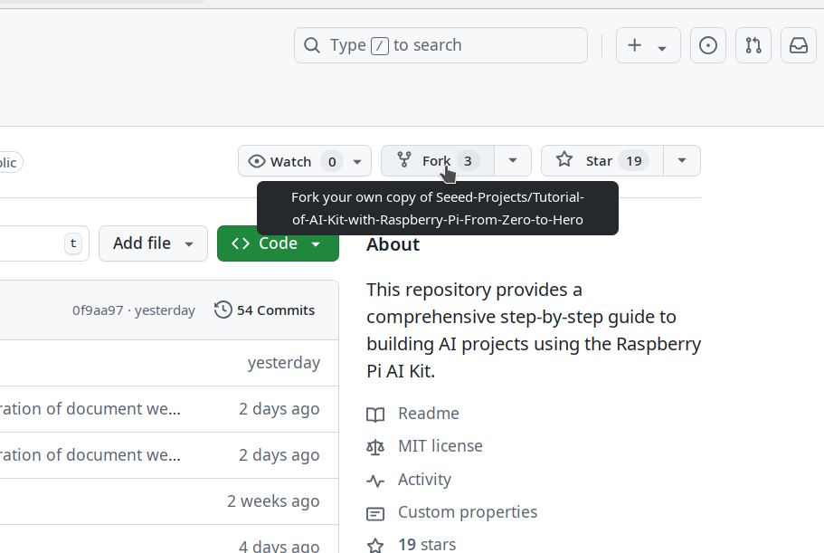
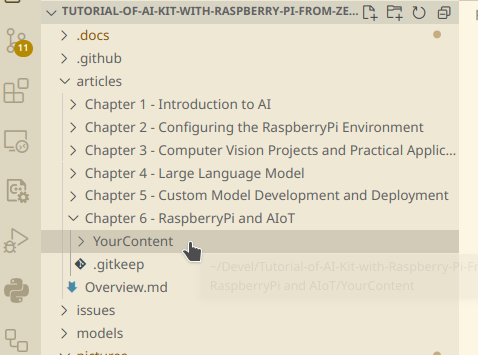
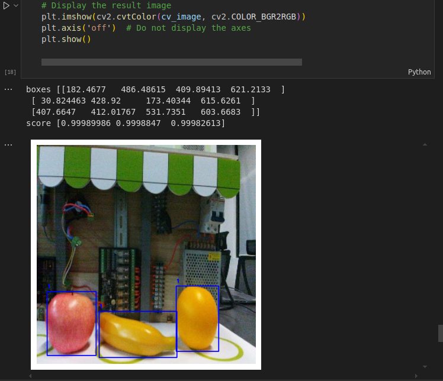
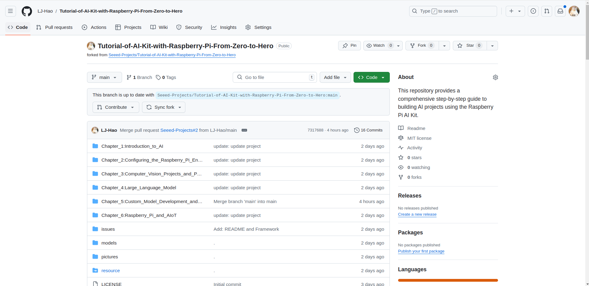

# Contributor Guidelines

## Project Directory Structure

```shell
.
├── articles
│   ├── Chapter 1 - Introduction to AI
│   ├── Chapter 2 - Configuring the RaspberryPi Environment
│   ├── Chapter 3 - Computer Vision Projects and Practical Applications
│   ├── Chapter 4 - Large Language Model
│   ├── Chapter 5 - Custom Model Development and Deployment
│   └── Chapter 6 - Raspberry Pi and AIoT
├── ContributorGuidelines.md
├── LICENSE
├── models
├── README.md
└── resource
```

### articles

```articles``` is the main directory of the project, and you can create subfolders named with your project name in ```Chapter 6: Raspberry Pi and AIoT```.

### models

```models``` is the folder you can store your models in ```.hef``` format, which can be directly deployed on the AI kit. The folder will be like:```/models/Chapter<x>/xxxx.hef```.

### pictures

```pictures``` is the folder you can store your pictures, your pictures can help you showcase your project. The folder will be like:```/pictures/Chapter<x>/xxxx_1.png```.


### resource

```resource``` is the folder you can store your ```Node-RED``` work flow. The folder will be like:```/resource/Chapterx/xxx.Json```.

## Contribution Process

### Fork Project

Open [Tutorial-of-AI-Kit-with-Raspberry-Pi-From-Zero-to-Hero](https://github.com/Seeed-Projects/Tutorial-of-AI-Kit-with-Raspberry-Pi-From-Zero-to-Hero) and ```Fork``` the project. And create a folder in the project's Chapter directory that you would like to contribute.



### Clone Project

Clone your forked project from your own repository URL. 

```shell
$ git clone https://github.com/<YourName>/Tutorial-of-AI-Kit-with-Raspberry-Pi-From-Zero-to-Hero.git
```

### Create your project

Choose one chapter in ```articles``` folder that you want to contribute, and create your project.



### Dataset

You should update your dataset to your [Google Drive](https://drive.google.com/drive/home) and then use command line to download it in your project. You can use it in Jupyter Notebook as follows:

```
%pip install gdown
!gdown https://drive.google.com/uc?id=1AtnoXEk8_2nhEspZ6BMMIoCxE9WYaC1S -O ../resource/
```

### Code

Your code should be Jupyter Notebook format and leave the necessary comments, remember to keep the result of your code. The following code is an example of your code:



### Push

Make sure your code works, then you can push your code to your own repository.

```shell
git add .
git commit -m "update: <ThePathOfYourProject>"
git push
```
### Open a Pull Request

Open your forked repository and create a pull request by clicking on the ```Pull Request``` button.


