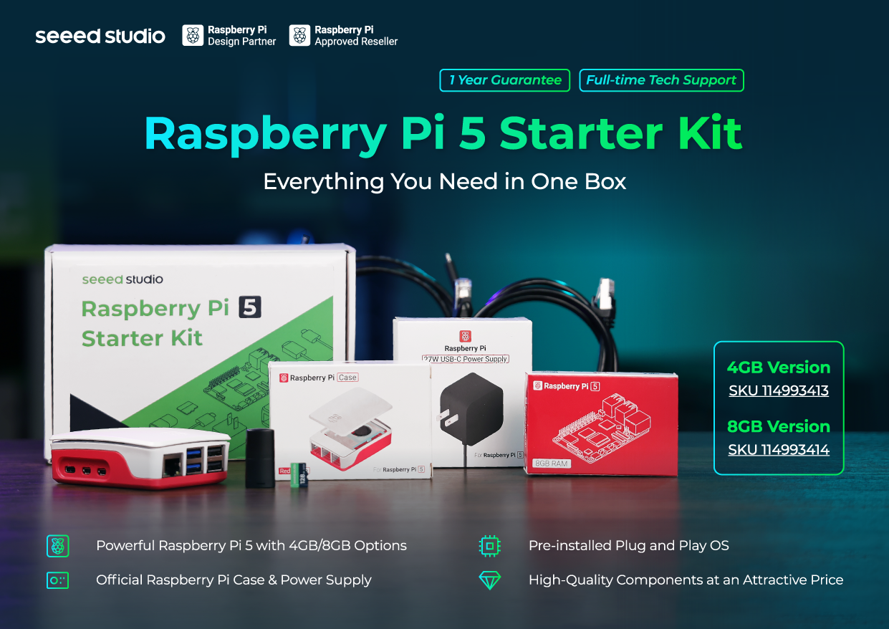

[![Contributors][contributors-shield]][contributors-url]
[![Forks][forks-shield]][forks-url]
[![Stargazers][stars-shield]][stars-url]
[![Issues][issues-shield]][issues-url]
[![MIT License][license-shield]][license-url]

  

<h3 align="center">
  <a href="https://seeed-projects.github.io/Tutorial-of-AI-Kit-with-Raspberry-Pi-From-Zero-to-Hero/">
    Tutorial of AI Kit with Raspberry Pi From Zero to Hero
  </a>
</h3>

   - Play your AI Kit from Beginner to Expert -
   
  
   
  <a href="https://github.com/Seeed-Projects/Tutorial-of-AI-Kit-with-Raspberry-Pi-From-Zero-to-Hero/issues/new?labels=bug&template=bug_report.md">Report Bug</a> |
  <a href="https://github.com/Seeed-Projects/Tutorial-of-AI-Kit-with-Raspberry-Pi-From-Zero-to-Hero/issues/new?labels=enhancement&template=feature_request.md">Request Feature</a>

## 🛠️ About The Project

This course is designed to teach you how to harness the power of AI on the Raspberry Pi, with a particular focus on using an AI kit to perform essential computer vision tasks. Throughout the course, you'll learn how to integrate AI into real-world IoT (Internet of Things) applications, from object detection and image classification to more complex visual recognition tasks. We will guide you step-by-step through setting up your Raspberry Pi, using AI frameworks, and deploying these models in various practical scenarios. Whether you are a hobbyist, a student, or a professional, this course will provide you with the foundational knowledge and hands-on experience necessary to bring AI-driven solutions to life on resource-constrained devices like the Raspberry Pi.

## 📚 Pre-requisites

### For AIoT objects

	<table align="center">
		<tr>
			<th>reComputer r1000</th>
			<th>Raspberry Pi AI Kit</th>
		</tr>
		<tr>
			<td>
				

					
				

			</td>
			<td>
				

					
				

			</td>
		</tr>
		<tr>
			<td>
				

					<a class="get_one_now_item" href="https://www.seeedstudio.com/reComputer-R1035-10-p-5925.html?utm_source=PiAICourse&utm_medium=github&utm_campaign=Course">
						<strong>
							
								Get One Now 🖱️
							
						</strong>
					</a>
				

			</td>
			<td>
				

					<a class="get_one_now_item" href="https://www.seeedstudio.com/Raspberry-Pi-AI-Kit-p-5900.html?utm_source=PiAICourse&utm_medium=github&utm_campaign=Course">
						<strong>
							
								Get One Now 🖱️
							
						</strong>
					</a>
				

			</td>
		</tr>
	</table>

### For LLM object 

	<table align="center">
		<tr>
			<th>reComputer AI R2130</th>
		</tr>
		<tr>
			<td>
				

					
				

			</td>
		</tr>
		<tr>
			<td>
				

					<a class="get_one_now_item" href="https://www.seeedstudio.com/Raspberry-Pi5-8GB-Kit-p-6254.html?utm_source=PiAICourse&utm_medium=github&utm_campaign=Course">
						<strong>
							
								Get One Now 🖱️
							
						</strong>
					</a>
				

			</td>
		</tr>
	</table>

### For Vision&LLM object 

	<table align="center" style="width: 100%; border-collapse: collapse;">
		<tr>
			<th>reComputer AI R2130</th>
		</tr>
		<tr>
			<td>
				

					
				

			</td>
		</tr>
		<tr>
			<td style="height: 100px; display: flex; align-items: center; justify-content: center;">
				<a class="get_one_now_item" href="https://www.seeedstudio.com/reComputer-AI-R2130-12-p-6368.html?utm_source=PiAICourse&utm_medium=github&utm_campaign=Course" style="text-decoration: none; background-color: #0078D7; padding: 10px 20px; border-radius: 5px; color: #FFFFFF; font-size: 16px;">
					<strong>Get One Now 🖱️</strong>
				</a>
			</td>
		</tr>
	</table>

## 📚 Recommended Reading

### Machine Learning

[Introduction to Machine Learning with Python](https://github.com/amueller/introduction_to_ml_with_python)

[Hands-On Machine Learning with Scikit-Learn, Keras, and TensorFlow](http://14.139.161.31/OddSem-0822-1122/Hands-On_Machine_Learning_with_Scikit-Learn-Keras-and-TensorFlow-2nd-Edition-Aurelien-Geron.pdf)

### Computer Vision

[Programming Computer Vision with Python](https://programmingcomputervision.com/downloads/ProgrammingComputerVision_CCdraft.pdf)

[Deep Learning for Computer Vision](https://machinelearningmastery.com/deep-learning-for-computer-vision/)

### Large Language Model

[Deep Learning for Natural Language Processing: Creating Neural Networks with Python](https://oku.ozturkibrahim.com/docs_python/Deep_Learning_for_Natural_Language_Processing.pdf)

## 🧱 Built With

* [![Raspberry Pi][Raspberry Pi.js]][Raspberry Pi-url]
* [![Seeed Studio][Seeed Studio.js]][Seeed Studio-url]
* [![HAILO][HAILO.js]][HAILO-url]
* [![Python][Python.js]][Python-url]
* [![Node Red][Node Red.js]][Node Red-url]
* [![TensorFlow][TensorFlow.com]][TensorFlow-url]
* [![OpenCV][OpenCV.com]][OpenCV-url]
* [![Pytorch][Pytorch.com]][Pytorch-url]

## 🗺️ Roadmap

⏳ Indicates in progress, ✔️ indicates completed.

### Chapter 1 [In Progress, Excepted Completion: November 2024]

- ✔️ Introduction of Artificial Intelligence
- ✔️ Introduction of Deep Neural Network
- ✔️ Introduction of Convolutional Neural Network
- ✔️ Introduction of Computer Vision
- ✔️ Introduction of Large Language Model

### Chapter 2 [In Progress, Excepted Completion: December 2024]

- ✔️ Introduction to Pytorch in Raspberry Pi Environment
- ✔️ Introduction to TensorFlow in Raspberry Pi Environment
- ✔️ Introduction to OpenCV in Raspberry Pi Environment
- ✔️ Introduction to Ultralytics in Raspberry Pi Environment
- ⏳ Introduction to Hailo in Raspberry Pi Environment

### Chapter 3 [In Progress, Excepted Completion: January 2025]

### Chapter 4 [Completed: November 2024]
- ✔️ Setup Ollama on RaspberryPi
- ✔️ Run Llama on RaspberryPi
- ✔️ Run Gemma2 on RaspberryPi
- ✔️ Run Phi3.5 on RaspberryPi
- ✔️ Run Multimodal on RaspberryPi
- ✔️ Use Ollama with Python

### Chapter 5 [In Progress, Excepted Completion: December 2024]

- ✔️ Training
- ✔️ Converting
- ✔️ Deploying

### Chapter 6

Open for everyone to contribute

See the [open issues](https://github.com/Seeed-Projects/Tutorial-of-AI-Kit-with-Raspberry-Pi-From-Zero-to-Hero/issues) for a full list of proposed features (and known issues).

## 🤝 Contributing

Contributions are what make the open source community such an amazing place to learn, inspire, and create. Any contributions you make are **greatly appreciated**.

If you have a suggestion that would make this better, please follow this [Contributor Guidelines](CONTRIBUTION.md) and contribute your own code.

Don't forget to give the project a star! Thanks again!

## 💞 Top contributors:

## 📄 License

Distributed under the MIT License. See `LICENSE` for more information.

## 🌟 Star History

[contributors-shield]: https://img.shields.io/github/contributors/Seeed-Projects/Tutorial-of-AI-Kit-with-Raspberry-Pi-From-Zero-to-Hero.svg?style=for-the-badge
[contributors-url]: https://github.com/Seeed-Projects/Tutorial-of-AI-Kit-with-Raspberry-Pi-From-Zero-to-Hero/graphs/contributors
[forks-shield]: https://img.shields.io/github/forks/Seeed-Projects/Tutorial-of-AI-Kit-with-Raspberry-Pi-From-Zero-to-Hero.svg?style=for-the-badge
[forks-url]: https://github.com/Seeed-Projects/Tutorial-of-AI-Kit-with-Raspberry-Pi-From-Zero-to-Hero/network/members
[stars-shield]: https://img.shields.io/github/stars/Seeed-Projects/Tutorial-of-AI-Kit-with-Raspberry-Pi-From-Zero-to-Hero.svg?style=for-the-badge
[stars-url]: https://github.com/Seeed-Projects/Tutorial-of-AI-Kit-with-Raspberry-Pi-From-Zero-to-Hero/stargazers
[issues-shield]: https://img.shields.io/github/issues/Seeed-Projects/Tutorial-of-AI-Kit-with-Raspberry-Pi-From-Zero-to-Hero.svg?style=for-the-badge
[issues-url]: https://github.com/Seeed-Projects/Tutorial-of-AI-Kit-with-Raspberry-Pi-From-Zero-to-Hero/issues
[license-shield]: https://img.shields.io/github/license/Seeed-Projects/Tutorial-of-AI-Kit-with-Raspberry-Pi-From-Zero-to-Hero.svg?style=for-the-badge
[license-url]: https://github.com/Seeed-Projects/Tutorial-of-AI-Kit-with-Raspberry-Pi-From-Zero-to-Hero/blob/master/LICENSE.txt
[product-screenshot]: images/screenshot.png
[Python.js]: https://img.shields.io/badge/Python-3776AB?style=for-the-badge&logo=python&logoColor=white
[Python-url]: https://www.python.org/

[Raspberry Pi.js]: https://img.shields.io/badge/Raspberry%20Pi-A22846?style=for-the-badge&logo=raspberry-pi&logoColor=white
[Raspberry Pi-url]: https://www.raspberrypi.com/

[HAILO.js]: https://img.shields.io/badge/HAILO-blue?style=for-the-badge&logo=https://hailo.ai/wp-content/uploads/2023/08/Hailo.png&logoColor=white
[HAILO-url]: https://hailo.ai/

[Seeed Studio.js]: https://img.shields.io/badge/SeeedStudio-green?style=for-the-badge&logo=<https://media-cdn.seeedstudio.com/media/logo/stores/4/logo_2018_horizontal.png>&logoColor=white
[Seeed Studio-url]: https://www.seeedstudio.com/

[Node Red.js]: https://img.shields.io/badge/Node-RED-%2300B4A0?style=for-the-badge&logo=node-red&logoColor=white
[Node Red-url]: https://nodered.org/

[TensorFlow.com]: https://img.shields.io/badge/TensorFlow-2.17-orange?logo=tensorflow
[TensorFlow-url]: https://www.tensorflow.org/

[OpenCV.com]: https://img.shields.io/badge/OpenCV-v4.5.3-blue?logo=opencv
[OpenCV-url]: https://opencv.org/

[Pytorch.com]: https://img.shields.io/badge/PyTorch-v1.12.0-red?logo=pytorch
[Pytorch-url]: https://pytorch.org/

