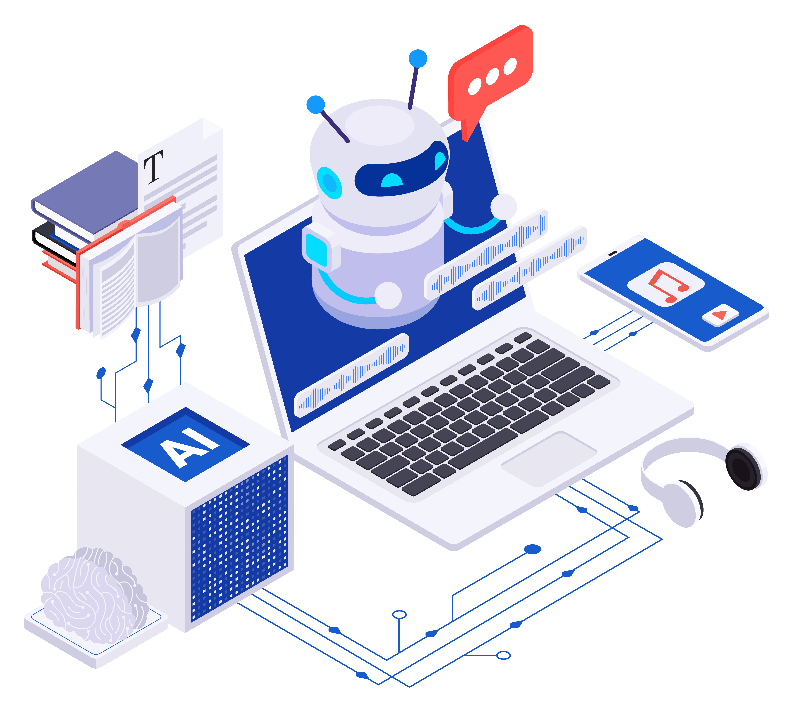
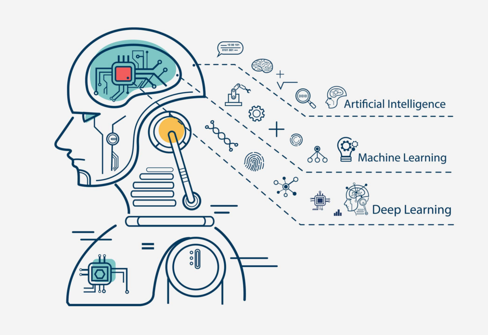

# Introduction of Artificial Intelligence

## Introduction

AI, or Artificial Intelligence, is a field of computer science focused on creating systems capable of performing tasks that typically require human intelligence. This includes problem-solving, reasoning, learning, perception, and language understanding.

## Types of AI Based on Capability

**Narrow AI (Weak AI)**:Designed to perform a specific task, such as facial recognition, spam filtering, or voice assistants like Siri. Narrow AI operates under a limited set of constraints and does not possess general intelligence.

**General AI (Strong AI)**：Hypothetical AI that could perform any intellectual task a human can. It would have reasoning abilities, problem-solving skills, and emotional intelligence, but it’s not yet a reality.

**Superintelligent AI**:AI surpassing human intelligence across all fields, from science to creativity. This remains theoretical.

## What is the difference between machine learning, deep learning, and artificial intelligence?

**Artificial Intelligence (AI)**: The broad field focused on creating systems that can perform tasks requiring human intelligence, like decision-making, problem-solving, and language understanding. AI is the overall goal of making machines "smart."

**Machine Learning (ML)**: A subset of AI where systems learn from data and improve over time without explicit programming. ML uses algorithms that identify patterns in data and make predictions or decisions based on those patterns.

**Deep Neural Networks (DNN)**: A specific type of ML that uses multi-layered neural networks to analyze complex data. DNNs are part of Deep Learning (a subset of ML), enabling tasks like image recognition, language translation, and advanced speech processing by mimicking how the human brain processes information.

[Reference](https://www.atomcamp.com/how-to-learn-ai-skills-a-beginners-guide-in-2024/)

## How AI works?

Artificial intelligence (AI) systems operate by converting various data types like text, images, audio, and video into numbers that represent patterns, relationships, and features. Through mathematical models, AI then analyzes these patterns, enabling it to make decisions, recognize objects, translate languages, and more. Here are some of the core technologies powering AI:

### Neural Networks

Modeled after the human brain, these networks identify complex data patterns, especially in tasks like image and speech recognition.

### Natural Language Processing (NLP)

NLP enables AI to understand and generate human language, powering applications like chatbots, translations, and text analysis.

### Computer Vision (CV)

CV allows AI to "see" and interpret images or videos, used in facial recognition, self-driving cars, and medical imaging.

### Speech Recognition

Converts spoken language to text, making voice assistants and automated transcription possible.

### Generative AI (Gen AI)

Creates new content—text, images, and more—based on patterns in data, used in tools like GPT and image generation.

[Reference](https://swisscognitive.ch/2021/08/28/fields-of-artificial-intelligence/)

## Current Uses of AI

**Healthcare**: AI helps doctors diagnose faster, predict patient outcomes, and discover new treatments.

**Finance**: AI detects fraud, assists with customer service, and optimizes stock trading.

**Retail**: AI personalizes shopping experiences, forecasts demand, and manages inventory.

**Transportation**: AI powers self-driving cars, improves traffic flow, and optimizes routes.

**Manufacturing**: AI predicts maintenance needs, checks quality, and automates processes.

[Reference](https://www.linkedin.com/pulse/guide-real-world-ai-machine-learning-use-cases-imtiaz-adam/)

## Benefits of AI in IIoT

**Predictive Maintenance**: AI predicts equipment issues before they happen, reducing downtime and repair costs.

**Operational Efficiency**: AI finds process improvements to cut costs and save energy.

**Quality Control**: AI catches product defects early, ensuring high-quality output.

**Supply Chain Optimization**: AI predicts demand and optimizes inventory, making delivery faster and cheaper.

**Worker Safety**: AI monitors for hazards to keep workplaces safer.

**Real-Time Monitoring**: AI tracks and adjusts equipment in real-time, minimizing delays.

**Energy Management**: AI reduces energy use by managing equipment smartly.

**Inventory Management**: AI tracks and forecasts stock needs, preventing shortages and excess.

