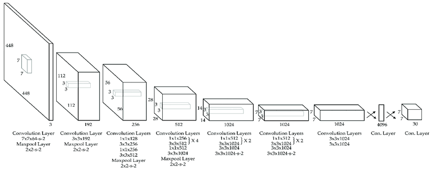

# Introduction of Convolutional Neural Network

## Convolution Neural Network 

Convolutional Neural Networks (CNNs) are a specialized type of deep learning model designed to process and analyze visual data, such as images and videos. They are particularly effective at recognizing patterns and spatial hierarchies within images, making them ideal for tasks like object detection, image classification, and facial recognition. Unlike traditional neural networks, CNNs use convolutional layers to automatically learn local features, which allows them to excel in capturing visual information. This makes CNNs the state-of-the-art approach for many image-related AI applications.

[References](https://towardsdatascience.com/a-comprehensive-guide-to-convolutional-neural-networks-the-eli5-way-3bd2b1164a53)

### Why CNN is Different from DNN

- **CNN is designed for image data**:
  - CNNs are specialized for processing and analyzing images by automatically learning patterns like edges, shapes, and textures.
  - DNNs are more general and can be used for various tasks, but they don't excel at spatial pattern recognition like CNNs.
- **Local feature learning vs. Global feature learning**:
  - CNN uses convolutional layers that focus on small regions of an image (local features), capturing spatial relationships.
  - DNNs use fully connected layers that consider the entire input (global features), making them less effective for image data.
- **CNN uses fewer parameters**:
  - CNN’s convolutional layers are sparsely connected (not every neuron connects to every input), reducing the number of parameters and computation.
  - DNN’s layers are fully connected, which increases the number of parameters, making them less efficient for image processing tasks.
- **Better for spatial data**:
  - CNN is excellent for image-related tasks like object detection and classification because it recognizes spatial hierarchies in data.
  - DNNs, although effective, do not naturally handle spatial information in the same way.

### Basic CNN Structure

**Convolution Layer:**
- Extracts features from the image by applying filters (kernels) that detect patterns like edges, textures, etc.
- Output: Feature maps that represent learned patterns.

[References](https://compneuro.neuromatch.io/tutorials/W1D5_DeepLearning/student/W1D5_Tutorial2.html)

**Pooling Layer**
- Reduces the size of feature maps (down-sampling) to make computation more efficient.
- Common technique: Max-pooling, where the maximum value in a region is taken to reduce data size.

**Fully Connected Layer (FC)**:

- A traditional layer where all neurons are connected to every neuron in the previous layer.
- Helps in combining the features extracted by convolution layers to make final predictions.

**Output Layer**:
- The final layer where the model gives its prediction, such as identifying the object in an image.

[References](https://www.youtube.com/watch?v=CXOGvCMLrkA)

## What are the Popular Image Classification architectures?

**LeNet**
   - LeNet, developed by Yann LeCun in 1998, is one of the first CNN models, designed for handwritten digit recognition (like the MNIST dataset). 
   - It has a simple structure with two convolutional layers followed by pooling layers, and fully connected layers for classification. 
   - LeNet laid the foundation for modern CNNs and is used in early computer vision tasks like digit classification.

**VGG16**
   - VGG16, created by the Visual Geometry Group at Oxford, is a deep CNN with 16 layers, primarily used for image classification tasks. 
   - It uses small 3x3 convolution filters and stacks multiple layers together to capture detailed features, followed by fully connected layers.
   - VGG16 is popular for its simplicity and effectiveness in large-scale image classification and object detection tasks.

Here’s a comparative chart of popular CNN architectures 

Here’s a comparative chart of popular CNN architectures 

| **Architecture** | **Year** | **Key Features**                              | **Use Cases**                             |
|------------------|----------|-----------------------------------------------|-------------------------------------------|
| **LeNet**        | 1998     | - 5-layer CNN for digit classification   - First successful CNN on MNIST dataset | Digit classification (e.g., MNIST), handwriting recognition |
| **VGG16**        | 2014     | - Deep 16-layer network   - Uses only 3x3 convolutional filters   - High parameter count | Image classification, object detection, transfer learning |
| **ResNet**       | 2015     | - Introduced "skip connections" (residual connections)   - Very deep (up to 152 layers)   - Mitigates vanishing gradient problem | Image recognition, object detection, medical imaging |
| **MobileNet**    | 2017     | - Optimized for mobile and edge devices   - Depthwise separable convolutions reduce parameters   - Lightweight and fast | Mobile applications, real-time image processing on edge devices |
| **EfficientNet** | 2019     | - Compound scaling method (scales width, depth, resolution)   - Efficient use of resources, achieving high accuracy with fewer parameters | Image classification, object detection, embedded AI applications |

## Object Detection 

Object detection is a computer vision technique that identifies and localizes objects within images or video by marking them with bounding boxes. Unlike simple image classification, which only labels an entire image, object detection provides spatial information, detecting multiple objects and their positions simultaneously. It enables applications ranging from autonomous driving to real-time surveillance by combining classification and localization tasks. This makes it a crucial step toward understanding visual scenes in depth.

## Object Detection Architectures

**Two-Stage Detectors**

Two-stage detectors work in two main steps. First, they generate region proposals—likely areas in the image where objects might be located. Then, in the second stage, they refine these proposals and classify them into specific object categories. This approach balances accuracy by focusing on the most relevant parts of an image, which improves detection but can slow down processing.

Ex: R-CNN, Fast RCNN

**Single-Stage Detectors**

Single-stage detectors streamline the process by predicting bounding boxes and class labels in a single pass over the image. Instead of generating region proposals first, they treat object detection as a dense prediction problem—examining the entire image at once, making them faster than two-stage methods. These models are generally more suitable for real-time applications, though sometimes less accurate.

Ex: SSD and Yolo

Here’s a chart comparing popular object detection architectures

| **Architecture**       | **Year** | **Key Features**                                                                                 | **Use Cases**                             |
|------------------------|----------|--------------------------------------------------------------------------------------------------|-------------------------------------------|
| **R-CNN**              | 2014     | - Two-stage detector   - Selective search to generate region proposals   - Slow and high memory usage | Object detection in high-resolution images (e.g., satellite, medical imaging) |
| **SSD (Single Shot Detector)** | 2016     | - Single-stage detector   - Multi-scale feature maps   - Balances speed and accuracy | Real-time detection, self-driving cars, security cameras |
| **YOLO (You Only Look Once)** | 2016     | - Single-stage detector   - Divides image into grid cells   - Fast, optimized for real-time applications | Surveillance, autonomous vehicles, video analysis |
| **SSD_MobileNet**      | 2017     | - MobileNet backbone for lightweight, mobile-friendly performance   - Suitable for edge devices | Mobile and IoT devices, embedded systems, robotics |
| **EfficientDet**       | 2020     | - EfficientNet backbone   - Uses compound scaling   - High accuracy with lower computation | Real-time applications on limited hardware, drones, edge AI |

