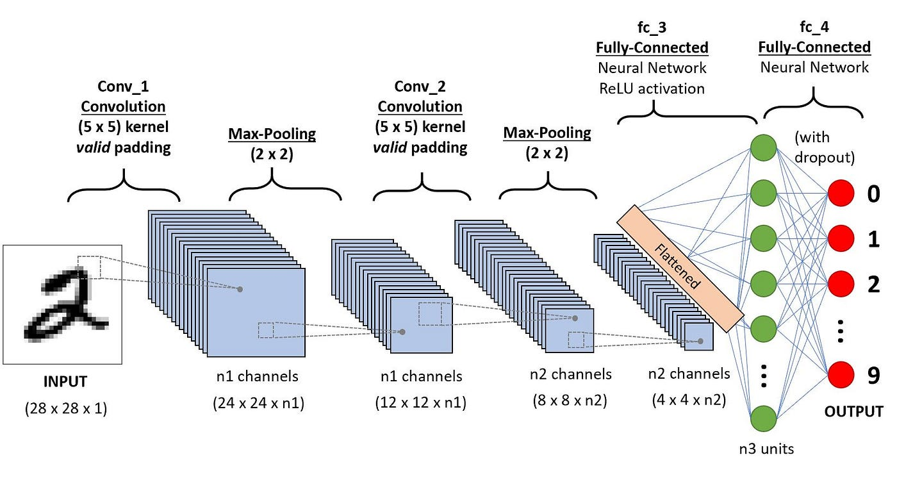
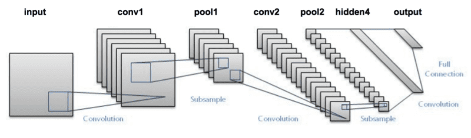

# Introduction to DNN 

## What is Deep Learning?

Deep learning is a type of artificial intelligence where computers learn to understand data in a way similar to how the human brain works. It uses layers of "neurons" to recognize patterns in things like images, text, and sounds. By analyzing large amounts of data, deep learning helps computers make decisions and predictions without needing specific instructions for every task. It's the technology behind many modern tools, such as facial recognition, voice assistants, and self-driving cars.

## Why Deep Learning 

- Efficiently processes unstructured data (e.g., images, text, audio).
- Discovers hidden relationships and patterns in large datasets.
- Excels at handling complex tasks like image recognition, natural language processing, and more.

## What are the components of a deep learning network?

A deep neural network (DNN) is built from layers of artificial "neurons," inspired by how the human brain works. Here's a simple breakdown of the key components and concepts:

- **Input layer**: This is where your data enters the network. Each input is converted into numbers, which are then passed to the next layer.
   
- **Hidden layers**: These are the layers between the input and output. The more hidden layers you have, the deeper your network. Each neuron in a hidden layer takes inputs, processes them, and passes the result to the next layer. Hidden layers help the network learn complex patterns.

- **Output layer**: This final layer provides the result, which could be a classification (e.g., yes or no) or a range of values depending on the task.

- **Weights and biases**: Every connection between neurons has a weight, which determines the importance of the input. Bias is an extra value that helps the neuron make better decisions.

- **Activation function**: Each neuron uses an activation function to decide if it should "fire" or not. This function simulates the way real neurons work, making the network learn and adjust.

If you're ready to dive deep, [this guide](https://www.3blue1brown.com/lessons/neural-networks) is perfect for exploring every detail.

In essence, a DNN learns by adjusting its weights and biases through training on data, gradually improving its predictions. The goal is to get better at recognizing patterns and making accurate decisions.

## What is a Neuron?

A neuron (or perceptron) in a neural network works by receiving inputs, each multiplied by a weight that shows its importance. It then adds these weighted inputs together, and if the sum passes a certain threshold, the neuron "fires" by sending an output signal. This output is passed through an activation function, which helps decide whether the neuron should activate (e.g., output a 1) or stay inactive (e.g., output a 0). The result is then sent to the next neuron in the network to continue the process.

## How Neural Network training ?

- **Feed data into the network**: Input your training data into the network through the input layer.
- **Forward propagation**: The data moves through the hidden layers, and the network makes a prediction based on its current weights and biases.
- **Calculate loss**: Compare the network's prediction to the actual target (desired output) and calculate the error, known as loss.
- **Backpropagation**: Adjust the weights and biases by passing the error backward through the network to minimize the loss.
- **Repeat and optimize**: Continue feeding data and adjusting weights through multiple iterations (epochs) until the network learns to make accurate predictions.

## Convolution Neural Network 

Convolutional Neural Networks (CNNs) are a specialized type of deep learning model designed to process and analyze visual data, such as images and videos. They are particularly effective at recognizing patterns and spatial hierarchies within images, making them ideal for tasks like object detection, image classification, and facial recognition. Unlike traditional neural networks, CNNs use convolutional layers to automatically learn local features, which allows them to excel in capturing visual information. This makes CNNs the state-of-the-art approach for many image-related AI applications.

[References](https://towardsdatascience.com/a-comprehensive-guide-to-convolutional-neural-networks-the-eli5-way-3bd2b1164a53)

### Why CNN is Different from DNN

- **CNN is designed for image data**:
  - CNNs are specialized for processing and analyzing images by automatically learning patterns like edges, shapes, and textures.
  - DNNs are more general and can be used for various tasks, but they don't excel at spatial pattern recognition like CNNs.
- **Local feature learning vs. Global feature learning**:
  - CNN uses convolutional layers that focus on small regions of an image (local features), capturing spatial relationships.
  - DNNs use fully connected layers that consider the entire input (global features), making them less effective for image data.
- **CNN uses fewer parameters**:
  - CNN’s convolutional layers are sparsely connected (not every neuron connects to every input), reducing the number of parameters and computation.
  - DNN’s layers are fully connected, which increases the number of parameters, making them less efficient for image processing tasks.
- **Better for spatial data**:
  - CNN is excellent for image-related tasks like object detection and classification because it recognizes spatial hierarchies in data.
  - DNNs, although effective, do not naturally handle spatial information in the same way.

### Basic CNN Structure

**Convolution Layer:**
- Extracts features from the image by applying filters (kernels) that detect patterns like edges, textures, etc.
- Output: Feature maps that represent learned patterns.

[References](https://compneuro.neuromatch.io/tutorials/W1D5_DeepLearning/student/W1D5_Tutorial2.html)

**Pooling Layer**
- Reduces the size of feature maps (down-sampling) to make computation more efficient.
- Common technique: Max-pooling, where the maximum value in a region is taken to reduce data size.

**Fully Connected Layer (FC)**:

- A traditional layer where all neurons are connected to every neuron in the previous layer.
- Helps in combining the features extracted by convolution layers to make final predictions.

**Output Layer**:
- The final layer where the model gives its prediction, such as identifying the object in an image.

[References](https://www.youtube.com/watch?v=CXOGvCMLrkA)

## What are the Popular Image Classification architectures? 

**LeNet**
   - LeNet, developed by Yann LeCun in 1998, is one of the first CNN models, designed for handwritten digit recognition (like the MNIST dataset). 
   - It has a simple structure with two convolutional layers followed by pooling layers, and fully connected layers for classification. 
   - LeNet laid the foundation for modern CNNs and is used in early computer vision tasks like digit classification.

**VGG16**
   - VGG16, created by the Visual Geometry Group at Oxford, is a deep CNN with 16 layers, primarily used for image classification tasks. 
   - It uses small 3x3 convolution filters and stacks multiple layers together to capture detailed features, followed by fully connected layers.
   - VGG16 is popular for its simplicity and effectiveness in large-scale image classification and object detection tasks.

## Object Detection 

Object detection is a computer vision technique that identifies and localizes objects within images or video by marking them with bounding boxes. Unlike simple image classification, which only labels an entire image, object detection provides spatial information, detecting multiple objects and their positions simultaneously. It enables applications ranging from autonomous driving to real-time surveillance by combining classification and localization tasks. This makes it a crucial step toward understanding visual scenes in depth.

## Object Detection Architectures

**Two-Stage Detectors**

Two-stage detectors work in two main steps. First, they generate region proposals—likely areas in the image where objects might be located. Then, in the second stage, they refine these proposals and classify them into specific object categories. This approach balances accuracy by focusing on the most relevant parts of an image, which improves detection but can slow down processing.

Ex: R-CNN, Fast RCNN

**Single-Stage Detectors**

Single-stage detectors streamline the process by predicting bounding boxes and class labels in a single pass over the image. Instead of generating region proposals first, they treat object detection as a dense prediction problem—examining the entire image at once, making them faster than two-stage methods. These models are generally more suitable for real-time applications, though sometimes less accurate.

Ex: SSD and Yolo

