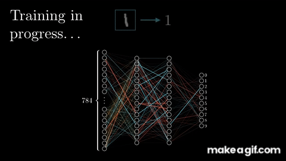

# Introduction to DNN

## What is Deep Learning?

Deep learning is a type of artificial intelligence where computers learn to understand data in a way similar to how the human brain works. It uses layers of "neurons" to recognize patterns in things like images, text, and sounds. By analyzing large amounts of data, deep learning helps computers make decisions and predictions without needing specific instructions for every task. It's the technology behind many modern tools, such as facial recognition, voice assistants, and self-driving cars.

## Why Deep Learning 

- Efficiently processes unstructured data (e.g., images, text, audio).
- Discovers hidden relationships and patterns in large datasets.
- Excels at handling complex tasks like image recognition, natural language processing, and more.

## What are the components of a deep learning network?

A deep neural network (DNN) is built from layers of artificial "neurons," inspired by how the human brain works. Here's a simple breakdown of the key components and concepts:

- **Input layer**: This is where your data enters the network. Each input is converted into numbers, which are then passed to the next layer.
   
- **Hidden layers**: These are the layers between the input and output. The more hidden layers you have, the deeper your network. Each neuron in a hidden layer takes inputs, processes them, and passes the result to the next layer. Hidden layers help the network learn complex patterns.

- **Output layer**: This final layer provides the result, which could be a classification (e.g., yes or no) or a range of values depending on the task.

- **Weights and biases**: Every connection between neurons has a weight, which determines the importance of the input. Bias is an extra value that helps the neuron make better decisions.

- **Activation function**: Each neuron uses an activation function to decide if it should "fire" or not. This function simulates the way real neurons work, making the network learn and adjust.

If you're ready to dive deep, [this guide](https://www.3blue1brown.com/lessons/neural-networks) is perfect for exploring every detail.

In essence, a DNN learns by adjusting its weights and biases through training on data, gradually improving its predictions. The goal is to get better at recognizing patterns and making accurate decisions.

## What is a Neuron?

A neuron (or perceptron) in a neural network works by receiving inputs, each multiplied by a weight that shows its importance. It then adds these weighted inputs together, and if the sum passes a certain threshold, the neuron "fires" by sending an output signal. This output is passed through an activation function, which helps decide whether the neuron should activate (e.g., output a 1) or stay inactive (e.g., output a 0). The result is then sent to the next neuron in the network to continue the process.

## How Neural Network training?

- **Feed data into the network**: Input your training data into the network through the input layer.
- **Forward propagation**: The data moves through the hidden layers, and the network makes a prediction based on its current weights and biases.
- **Calculate loss**: Compare the network's prediction to the actual target (desired output) and calculate the error, known as loss.
- **Backpropagation**: Adjust the weights and biases by passing the error backward through the network to minimize the loss.
- **Repeat and optimize**: Continue feeding data and adjusting weights through multiple iterations (epochs) until the network learns to make accurate predictions.

