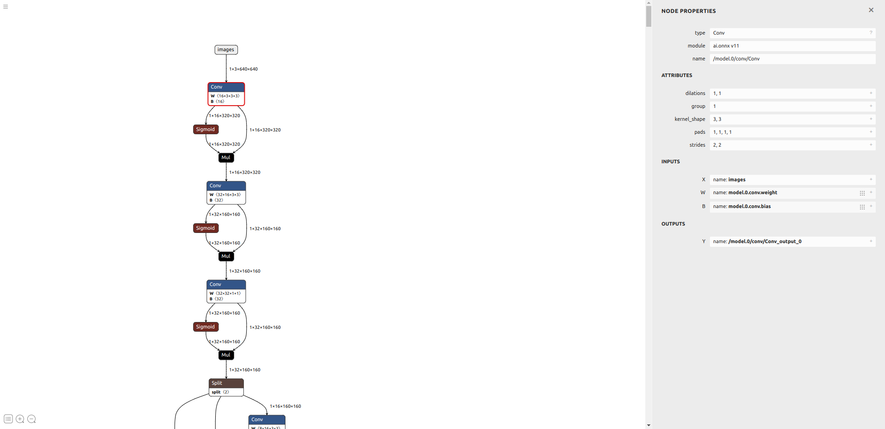
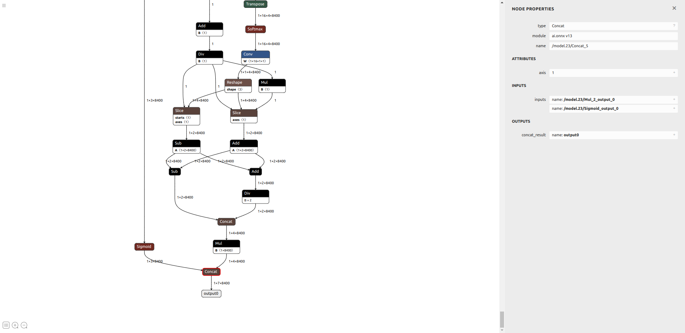

---


sidebar_position: 3


---


> You can get this [Notebook](https://github.com/Seeed-Projects/Tutorial-of-AI-Kit-with-Raspberry-Pi-From-Zero-to-Hero/blob/main/articles/Chapter%205%20-%20Custom%20Model%20Development%20and%20Deployment/Convert%20Your%20Model.ipynb) on GitHub.


## Step 1: Prepare your environment on your host computer


**Note: This part of code run on your host computer**


The Jupyter Notebook right up have a button like , then you choose ```Select Another Kernel```, and choose ```Python Environments```, then choose ```Creat Python Environment``` and choose ```Venv```, then choose ```python3.10```.


```python
# Here is my hostcomputer information
# Linux PC 6.8.0-45-generic #45~22.04.1-Ubuntu SMP PREEMPT_DYNAMIC Wed Sep 11 15:25:05 UTC 2 x86_64 x86_64 x86_64 GNU/Linux

!uname -a
```


```
Linux PC 6.8.0-45-generic #45~22.04.1-Ubuntu SMP PREEMPT_DYNAMIC Wed Sep 11 15:25:05 UTC 2 x86_64 x86_64 x86_64 GNU/Linux

```

 

```python
# Here is my python version
# Python 3.10.12

!python -V
```


```
Python 3.10.12

```

 

```python
# Download gdown to install software from google driver, if you see 'install successfully' it means you install libs successfully, or when you see 'install error' it means you install libs unsuccessfully
try:
    %pip install gdown -q
    print('install successfully')
except:
    print('install error')
```


```
Note: you may need to restart the kernel to use updated packages.
install successfully

```

 

```python
# Install hailo_dataflow_compiler-3.28.0-py3-none-linux_x86_64.whl from google driver


!gdown https://drive.google.com/uc?id=1BbEbNIrmAJkzc5Lrgcji92Nskx6gbJ_X -O ../resource/
```


```
Downloading...
From (original): https://drive.google.com/uc?id=1BbEbNIrmAJkzc5Lrgcji92Nskx6gbJ_X
From (redirected): https://drive.google.com/uc?id=1BbEbNIrmAJkzc5Lrgcji92Nskx6gbJ_X&confirm=t&uuid=aa6c148c-9c0c-48ee-9fbe-351b83cdf5f2
To: /home/jiahao/example/Tutorial-of-AI-Kit-with-Raspberry-Pi-From-Zero-to-Hero/resource/hailo_dataflow_compiler-3.28.0-py3-none-linux_x86_64.whl
100%|████████████████████████████████████████| 708M/708M [01:03<00:00, 11.1MB/s]

```

 

```python
# Install HailoDFC to compile the model
try:
    %pip install ../resource/hailo_dataflow_compiler-3.28.0-py3-none-linux_x86_64.whl -q
    print('install successfully')
except:
    print('install error')
```


```
Note: you may need to restart the kernel to use updated packages.
install successfully

```

 


## Step 2: Open [Netron](https://netron.app/)


For parsing ONNX model, we should find the input node and output node from computational graph, open faster_rcnn.onnx from [netron](https://netron.app/):


The below image show that the input node name is ```/model.0/conv/Conv```





The below image show that the output node name is ```/model.23/Concat_5```





## Step 3: Parse the model


Hailo Archive is a tar.gz archive file that captures the "state" of the model - the files and attributes used in a given stage from parsing to compilation. Use the save_har method to save the runner's state in any stage and load_har method to load a saved state to an uninitialized runner.


The initial HAR file includes:


HN file, which is a JSON-like representation of the graph structure that is deployed to the Hailo hardware.


NPZ file, which includes the weights of the model.


```python
import tensorflow as tf
from IPython.display import SVG

# import the ClientRunner class from the hailo_sdk_client package
from hailo_sdk_client import ClientRunner
```


```
2024-10-21 10:58:12.479177: I tensorflow/core/platform/cpu_feature_guard.cc:182] This TensorFlow binary is optimized to use available CPU instructions in performance-critical operations.
To enable the following instructions: AVX2 FMA, in other operations, rebuild TensorFlow with the appropriate compiler flags.
2024-10-21 10:58:13.067133: W tensorflow/compiler/tf2tensorrt/utils/py_utils.cc:38] TF-TRT Warning: Could not find TensorRT

```

 

```
[info] First time Hailo Dataflow Compiler is being used. Checking system requirements... (this might take a few seconds)
[Warning] It is recommended to have 32 GB of RAM, while this system has only 29 GB.
[Info] No GPU connected.
Component                                Requirement                    Found                            
==========  ==========       ==========  ==========                                                      
OS                                       Ubuntu               Ubuntu                                     Required
Release     20.04                        22.04                                    Required               
Package     python3-tk                   V                    Required                                   
Package     graphviz                     V                    Required                                   
Package     libgraphviz-dev              V                    Required                                   
Package     python3.10-dev               V                    Required                                   
RAM(GB)     16                           29                                       Required               
RAM(GB)     32                           29                                       Recommended            
CPU-Arch                                              x86_64  x86_64                           Required  
CPU-flag                                              avx     V                   Required               
Var:CC                       unset                    unset             Required                         
Var:CXX                      unset                    unset             Required                         
Var:LD                       unset                    unset             Required                         
Var:AS                       unset                    unset             Required                         
Var:AR                       unset                    unset             Required                         
Var:LN                       unset                    unset             Required                         
Var:DUMP                     unset                    unset             Required                         
Var:CPY                      unset                    unset             Required                         

```

 

```python
# Define the model name and onnx model path
onnx_model_name = "yolov11n"
onnx_path = "../models/Chapter5/best.onnx"
```


**Note: Sometimes for complex model like yolo the end node is not the last node we parse, so please check [parse guild](https://community.hailo.ai/t/parsing-yolo-models-with-the-hailo-dataflow-compiler-tool/2384) for more information.**


```python
# AI kit chip is hailo8l, so we choose hailo8l as hardware arch
chosen_hw_arch = "hailo8l"

runner = ClientRunner(hw_arch=chosen_hw_arch)
hn, npz = runner.translate_onnx_model(
    onnx_path,
    onnx_model_name,
    start_node_names=["/model.0/conv/Conv"], # the name of input node
    end_node_names=["/model.23/cv2.0/cv2.0.2/Conv", "/model.23/cv3.0/cv3.0.2/Conv", 
                    "/model.23/cv2.1/cv2.1.2/Conv", "/model.23/cv3.1/cv3.1.2/Conv", 
                    "/model.23/cv2.2/cv2.2.2/Conv", "/model.23/cv3.2/cv3.2.2/Conv"], # the name of output node
    net_input_shapes={"/model.0/conv/Conv": [1, 3, 640, 640]}, # input shape
)
```


```
[info] Translation started on ONNX model yolov11n
[info] Restored ONNX model yolov11n (completion time: 00:00:00.05)
[info] Extracted ONNXRuntime meta-data for Hailo model (completion time: 00:00:00.14)
[warning] ONNX shape inference failed: [ONNXRuntimeError] : 2 : INVALID_ARGUMENT : Failed to load model with error: /onnxruntime_src/onnxruntime/core/graph/model.cc:147 onnxruntime::Model::Model(onnx::ModelProto&&, const PathString&, const IOnnxRuntimeOpSchemaRegistryList*, const onnxruntime::logging::Logger&, const onnxruntime::ModelOptions&) Unsupported model IR version: 9, max supported IR version: 8

[info] NMS structure of yolov8 (or equivalent architecture) was detected.
[info] In order to use HailoRT post-processing capabilities, these end node names should be used: /model.23/cv2.0/cv2.0.2/Conv /model.23/cv3.0/cv3.0.2/Conv /model.23/cv2.1/cv2.1.2/Conv /model.23/cv3.1/cv3.1.2/Conv /model.23/cv2.2/cv2.2.2/Conv /model.23/cv3.2/cv3.2.2/Conv.
[info] Start nodes mapped from original model: 'images': 'yolov11n/input_layer1'.
[info] End nodes mapped from original model: '/model.23/cv2.0/cv2.0.2/Conv', '/model.23/cv3.0/cv3.0.2/Conv', '/model.23/cv2.1/cv2.1.2/Conv', '/model.23/cv3.1/cv3.1.2/Conv', '/model.23/cv2.2/cv2.2.2/Conv', '/model.23/cv3.2/cv3.2.2/Conv'.
[info] Unable to export parsing report: output
[info] Translation completed on ONNX model yolov11n (completion time: 00:00:00.76)

```

 

```python
# Save to har model

hailo_model_har_name = f"../models/Chapter5/{onnx_model_name}_hailo_model.har"
runner.save_har(hailo_model_har_name)
```


```
[info] Saved HAR to: /home/jiahao/example/Tutorial-of-AI-Kit-with-Raspberry-Pi-From-Zero-to-Hero/models/Chapter5/yolov11n_hailo_model.har

```

 

```python
# Use hailo command to parse the model

!hailo visualizer ../models/Chapter5/{onnx_model_name}_hailo_model.har 
```


```
[info] Current Time: 10:59:25, 10/21/24
[info] CPU: Architecture: x86_64, Model: AMD Ryzen 5 5600G with Radeon Graphics, Number Of Cores: 12, Utilization: 3.3%
[info] Memory: Total: 27GB, Available: 16GB
[info] System info: OS: Linux, Kernel: 6.8.0-45-generic
[info] Hailo DFC Version: 3.28.0
[info] HailoRT Version: Not Installed
[info] PCIe: No Hailo PCIe device was found
[info] Running `hailo visualizer ../models/Chapter5/yolov11n_hailo_model.har`

```

 


## Step 4: Model Optimization


The input is a HAR file in Hailo Model state (before optimization; with native weights) and the output will be a quantized HAR file with quantized weights.


```python
# General imports used throughout the tutorial
# file operations
import json
import os

import numpy as np
import tensorflow as tf
from IPython.display import SVG
from matplotlib import patches
from matplotlib import pyplot as plt
from PIL import Image
from tensorflow.python.eager.context import eager_mode

# import the hailo sdk client relevant classes
from hailo_sdk_client import ClientRunner, InferenceContext

%matplotlib inline

IMAGES_TO_VISUALIZE = 5
```


```python
# The folder of images
image_dir = './images'
image_files = [f for f in os.listdir(image_dir) if f.endswith(('.png', '.jpg', '.jpeg'))]

# Init the list
images = []

# Load every images
for image_file in image_files:
    img_path = os.path.join(image_dir, image_file)
    img = Image.open(img_path).convert('RGB')  # Transform to RGB format
    img_array = np.array(img)  # Transform to NumPy format
    images.append(img_array)

# Transform images to NumPy array
images_array = np.array(images)
```


```python
# Load our parsed HAR model

assert os.path.isfile(hailo_model_har_name), "Please provide valid path for HAR file"
runner = ClientRunner(har=hailo_model_har_name, hw_arch=chosen_hw_arch)
# By default it uses the hw_arch that is saved on the HAR. For overriding, use the hw_arch flag.
```


```python
# Call Optimize to perform the optimization process
runner.optimize(images_array)

# Save the result state to a Quantized HAR file
quantized_model_har_path = f"../models/Chapter5/{onnx_model_name}_quantized_model.har"
runner.save_har(quantized_model_har_path)
```


```
[info] Starting Model Optimization
[warning] Reducing optimization level to 0 (the accuracy won't be optimized and compression won't be used) because there's less data than the recommended amount (1024), and there's no available GPU
[warning] Running model optimization with zero level of optimization is not recommended for production use and might lead to suboptimal accuracy results
[info] Model received quantization params from the hn
[info] Starting Mixed Precision
[info] Mixed Precision is done (completion time is 00:00:00.60)
[info] Layer Norm Decomposition skipped
[info] Starting Stats Collector
[info] Using dataset with 11 entries for calibration

```

 

```
Calibration:   0%|          | 0/11 [00:00<?, ?entries/s]2024-10-21 11:00:21.315784: I tensorflow/core/common_runtime/executor.cc:1197] [/device:CPU:0] (DEBUG INFO) Executor start aborting (this does not indicate an error and you can ignore this message): INVALID_ARGUMENT: You must feed a value for placeholder tensor 'Placeholder/_0' with dtype int32
	 [[{{node Placeholder/_0}}]]
2024-10-21 11:00:21.315943: I tensorflow/core/common_runtime/executor.cc:1197] [/device:CPU:0] (DEBUG INFO) Executor start aborting (this does not indicate an error and you can ignore this message): INVALID_ARGUMENT: You must feed a value for placeholder tensor 'Placeholder/_0' with dtype int32
	 [[{{node Placeholder/_0}}]]
2024-10-21 11:00:21.341694: I tensorflow/core/common_runtime/executor.cc:1197] [/device:CPU:0] (DEBUG INFO) Executor start aborting (this does not indicate an error and you can ignore this message): INVALID_ARGUMENT: You must feed a value for placeholder tensor 'Placeholder/_0' with dtype float and shape [1,640,640,3]
	 [[{{node Placeholder/_0}}]]
Calibration:   9%|▉         | 1/11 [00:24<04:00, 24.10s/entries]2024-10-21 11:00:40.545491: I tensorflow/core/common_runtime/executor.cc:1197] [/device:CPU:0] (DEBUG INFO) Executor start aborting (this does not indicate an error and you can ignore this message): INVALID_ARGUMENT: You must feed a value for placeholder tensor 'Placeholder/_0' with dtype float and shape [1,640,640,3]
	 [[{{node Placeholder/_0}}]]
Calibration:  18%|█▊        | 2/11 [00:24<01:29,  9.99s/entries]2024-10-21 11:00:40.665725: I tensorflow/core/common_runtime/executor.cc:1197] [/device:CPU:0] (DEBUG INFO) Executor start aborting (this does not indicate an error and you can ignore this message): INVALID_ARGUMENT: You must feed a value for placeholder tensor 'Placeholder/_0' with dtype float and shape [1,640,640,3]
	 [[{{node Placeholder/_0}}]]
Calibration:  27%|██▋       | 3/11 [00:24<00:43,  5.48s/entries]2024-10-21 11:00:40.781685: I tensorflow/core/common_runtime/executor.cc:1197] [/device:CPU:0] (DEBUG INFO) Executor start aborting (this does not indicate an error and you can ignore this message): INVALID_ARGUMENT: You must feed a value for placeholder tensor 'Placeholder/_0' with dtype float and shape [1,640,640,3]
	 [[{{node Placeholder/_0}}]]
Calibration:  36%|███▋      | 4/11 [00:24<00:23,  3.37s/entries]2024-10-21 11:00:40.901007: I tensorflow/core/common_runtime/executor.cc:1197] [/device:CPU:0] (DEBUG INFO) Executor start aborting (this does not indicate an error and you can ignore this message): INVALID_ARGUMENT: You must feed a value for placeholder tensor 'Placeholder/_0' with dtype float and shape [1,640,640,3]
	 [[{{node Placeholder/_0}}]]
Calibration:  45%|████▌     | 5/11 [00:24<00:13,  2.19s/entries]2024-10-21 11:00:41.018819: I tensorflow/core/common_runtime/executor.cc:1197] [/device:CPU:0] (DEBUG INFO) Executor start aborting (this does not indicate an error and you can ignore this message): INVALID_ARGUMENT: You must feed a value for placeholder tensor 'Placeholder/_0' with dtype float and shape [1,640,640,3]
	 [[{{node Placeholder/_0}}]]
Calibration:  55%|█████▍    | 6/11 [00:24<00:07,  1.49s/entries]2024-10-21 11:00:41.142290: I tensorflow/core/common_runtime/executor.cc:1197] [/device:CPU:0] (DEBUG INFO) Executor start aborting (this does not indicate an error and you can ignore this message): INVALID_ARGUMENT: You must feed a value for placeholder tensor 'Placeholder/_0' with dtype float and shape [1,640,640,3]
	 [[{{node Placeholder/_0}}]]
Calibration:  64%|██████▎   | 7/11 [00:24<00:04,  1.04s/entries]2024-10-21 11:00:41.265197: I tensorflow/core/common_runtime/executor.cc:1197] [/device:CPU:0] (DEBUG INFO) Executor start aborting (this does not indicate an error and you can ignore this message): INVALID_ARGUMENT: You must feed a value for placeholder tensor 'Placeholder/_0' with dtype float and shape [1,640,640,3]
	 [[{{node Placeholder/_0}}]]
Calibration:  73%|███████▎  | 8/11 [00:24<00:02,  1.33entries/s]2024-10-21 11:00:41.391740: I tensorflow/core/common_runtime/executor.cc:1197] [/device:CPU:0] (DEBUG INFO) Executor start aborting (this does not indicate an error and you can ignore this message): INVALID_ARGUMENT: You must feed a value for placeholder tensor 'Placeholder/_0' with dtype float and shape [1,640,640,3]
	 [[{{node Placeholder/_0}}]]
Calibration:  82%|████████▏ | 9/11 [00:25<00:01,  1.78entries/s]2024-10-21 11:00:41.533249: I tensorflow/core/common_runtime/executor.cc:1197] [/device:CPU:0] (DEBUG INFO) Executor start aborting (this does not indicate an error and you can ignore this message): INVALID_ARGUMENT: You must feed a value for placeholder tensor 'Placeholder/_0' with dtype float and shape [1,640,640,3]
	 [[{{node Placeholder/_0}}]]
Calibration:  91%|█████████ | 10/11 [00:25<00:00,  2.36entries/s]2024-10-21 11:00:41.652414: I tensorflow/core/common_runtime/executor.cc:1197] [/device:CPU:0] (DEBUG INFO) Executor start aborting (this does not indicate an error and you can ignore this message): INVALID_ARGUMENT: You must feed a value for placeholder tensor 'Placeholder/_0' with dtype float and shape [1,640,640,3]
	 [[{{node Placeholder/_0}}]]
Calibration: 100%|██████████| 11/11 [00:25<00:00,  2.30s/entries]

```

 

```
[info] Stats Collector is done (completion time is 00:00:27.09)
[info] Starting Fix zp_comp Encoding
[info] Fix zp_comp Encoding is done (completion time is 00:00:00.00)
[info] Starting matmul_equalization
[info] matmul_equalization is done (completion time is 00:00:00.00)
[info] activation fitting started for yolov11n/ew_sub_softmax1/act_op
[info] activation fitting started for yolov11n/ne_activation_ew_sub_softmax1/act_op
[info] activation fitting started for yolov11n/reduce_sum_softmax1/act_op
[info] Finetune encoding skipped
[info] Bias Correction skipped
[info] Adaround skipped
[info] Fine Tune skipped
[info] Layer Noise Analysis skipped
[info] Model Optimization is done
[info] Saved HAR to: /home/jiahao/example/Tutorial-of-AI-Kit-with-Raspberry-Pi-From-Zero-to-Hero/models/Chapter5/yolov11n_quantized_model.har

```

 


## Step 5: Compile Hailo Archive Quantized Model to HEF


```python
runner = ClientRunner(har=quantized_model_har_path, hw_arch=chosen_hw_arch)
```


```python
hef = runner.compile()

file_name = f"../models/Chapter5/{onnx_model_name}.hef"

with open(file_name, "wb") as f:
    f.write(hef)
```


```
[info] To achieve optimal performance, set the compiler_optimization_level to "max" by adding performance_param(compiler_optimization_level=max) to the model script. Note that this may increase compilation time.
[info] Loading network parameters
[info] Starting Hailo allocation and compilation flow
[info] Finding the best partition to contexts...
[?25l[info] Iteration #1 - Contexts: 4
[info] Iteration #2 - Contexts: 4
[info] Iteration #3 - Contexts: 4
[info] Iteration #4 - Contexts: 4
[info] Iteration #5 - Contexts: 4
[info] Iteration #6 - Contexts: 4
[info] Iteration #7 - Contexts: 4
[info] Iteration #8 - Contexts: 4
[info] Iteration #9 - Contexts: 4
[info] Iteration #10 - Contexts: 4
[info] Iteration #11 - Contexts: 4
[info] Iteration #12 - Contexts: 4
[info] Iteration #13 - Contexts: 4
[info] Iteration #14 - Contexts: 4
[info] Iteration #15 - Contexts: 4
[info] Iteration #16 - Contexts: 4
[info] Iteration #17 - Contexts: 4
[info] Iteration #18 - Contexts: 4
[info] Iteration #19 - Contexts: 4
[info] Iteration #20 - Contexts: 4
[info] Iteration #21 - Contexts: 4
[info] Iteration #22 - Contexts: 4
[info] Iteration #23 - Contexts: 4
[info] Iteration #24 - Contexts: 4
[info] Iteration #25 - Contexts: 4
[info] Iteration #26 - Contexts: 4
[info] Iteration #27 - Contexts: 4
[info] Iteration #28 - Contexts: 4
[info] Iteration #29 - Contexts: 4
[info] Iteration #30 - Contexts: 4
[info] Iteration #31 - Contexts: 4
[info] Iteration #32 - Contexts: 4
[info] Iteration #33 - Contexts: 4
[info] Iteration #34 - Contexts: 4
[info] Iteration #35 - Contexts: 4
[info] Iteration #36 - Contexts: 4
[info] Iteration #37 - Contexts: 4
[info] Iteration #38 - Contexts: 4
[info] Iteration #39 - Contexts: 4
[info] Iteration #40 - Contexts: 4
[info] Iteration #41 - Contexts: 5
[info] Iteration #42 - Contexts: 5
[info] Iteration #43 - Contexts: 5
[info] Iteration #44 - Contexts: 5
[info] Iteration #45 - Contexts: 5
[info] Iteration #46 - Contexts: 5
[info] Iteration #47 - Contexts: 5
[info] Iteration #48 - Contexts: 5
[info] Iteration #49 - Contexts: 5
[info] Iteration #50 - Contexts: 5
[info] Iteration #51 - Contexts: 5
[info] Iteration #52 - Contexts: 5
[info] Iteration #53 - Contexts: 5
[info] Iteration #54 - Contexts: 5
[info] Iteration #55 - Contexts: 5
[info] Iteration #56 - Contexts: 5
[info] Iteration #57 - Contexts: 5
[info] Iteration #58 - Contexts: 5
[info] Iteration #59 - Contexts: 5
[info] Iteration #60 - Contexts: 5
[info] Iteration #61 - Contexts: 5
[info] Iteration #62 - Contexts: 5
[info] Iteration #63 - Contexts: 5
[info] Iteration #64 - Contexts: 5
[info] Iteration #65 - Contexts: 5
[info] Iteration #66 - Contexts: 5
[info] Iteration #67 - Contexts: 5
[info] Iteration #68 - Contexts: 5
[info] Iteration #69 - Contexts: 5
[info] Iteration #70 - Contexts: 5
[info] Iteration #71 - Contexts: 5
[info] Iteration #72 - Contexts: 5
[info] Iteration #73 - Contexts: 5
[info] Iteration #74 - Contexts: 5
[info] Iteration #75 - Contexts: 5
[info] Iteration #76 - Contexts: 5
[info] Iteration #77 - Contexts: 5
[info] Iteration #78 - Contexts: 5
[info] Iteration #79 - Contexts: 5
[info] Iteration #80 - Contexts: 5
[info] Iteration #81 - Contexts: 5
[info] Iteration #82 - Contexts: 5
[info] Iteration #83 - Contexts: 5
[info] Iteration #84 - Contexts: 5
[info] Iteration #85 - Contexts: 5
[info] Iteration #86 - Contexts: 5
[info] Iteration #87 - Contexts: 5
[info] Iteration #88 - Contexts: 5
[info] Iteration #89 - Contexts: 5
[info] Iteration #90 - Contexts: 5
[info] Iteration #91 - Contexts: 5
[info] Iteration #92 - Contexts: 5
[info] Iteration #93 - Contexts: 5
[info] Iteration #94 - Contexts: 5
[info] Iteration #95 - Contexts: 5
[info] Iteration #96 - Contexts: 5
[info] Iteration #97 - Contexts: 5
[info] Iteration #98 - Contexts: 5
[info] Iteration #99 - Contexts: 5
[info] Iteration #100 - Contexts: 5
[info] Iteration #101 - Contexts: 5
[info] Iteration #102 - Contexts: 5
[info] Iteration #103 - Contexts: 5
[info] Iteration #104 - Contexts: 5
[info] Iteration #105 - Contexts: 5
[info] Iteration #106 - Contexts: 5
[info] Iteration #107 - Contexts: 5
[info] Iteration #108 - Contexts: 5
[info] Iteration #109 - Contexts: 5
[info] Iteration #110 - Contexts: 5
[info] Iteration #111 - Contexts: 5
[info] Iteration #112 - Contexts: 5
[info] Iteration #113 - Contexts: 5
[info] Iteration #114 - Contexts: 5
[info] Iteration #115 - Contexts: 5
[info] Iteration #116 - Contexts: 5
[info] Iteration #117 - Contexts: 5
[info] Iteration #118 - Contexts: 5
[info] Iteration #119 - Contexts: 5
[info] Iteration #120 - Contexts: 5
[info] Iteration #121 - Contexts: 5
[info] Iteration #122 - Contexts: 5
[info] Iteration #123 - Contexts: 5
[info] Iteration #124 - Contexts: 5
[info] Iteration #125 - Contexts: 5
[info] Iteration #126 - Contexts: 5
[info] Iteration #127 - Contexts: 5
[info] Iteration #128 - Contexts: 5
[info] Iteration #129 - Contexts: 5
[info] Iteration #130 - Contexts: 5
[info] Iteration #131 - Contexts: 5
[info] Iteration #132 - Contexts: 5
[info] Iteration #133 - Contexts: 5
[info] Iteration #134 - Contexts: 5
[info] Iteration #135 - Contexts: 5
[info] Iteration #136 - Contexts: 5
[info] Iteration #137 - Contexts: 5
[info] Iteration #138 - Contexts: 5
[info] Iteration #139 - Contexts: 5
[info] Iteration #140 - Contexts: 5
[info] Iteration #141 - Contexts: 5
[info] Iteration #142 - Contexts: 5
[info] Iteration #143 - Contexts: 5
[info] Iteration #144 - Contexts: 5
[info] Iteration #145 - Contexts: 5
[info] Iteration #146 - Contexts: 5
[info] Iteration #147 - Contexts: 6
[info] Iteration #148 - Contexts: 6
[info] Iteration #149 - Contexts: 6
[info] Iteration #150 - Contexts: 6
[info] Iteration #151 - Contexts: 6
[info] Iteration #152 - Contexts: 6
[info] Iteration #153 - Contexts: 6
[info] Iteration #154 - Contexts: 6
[info] Iteration #155 - Contexts: 6
[info] Iteration #156 - Contexts: 6
[info] Iteration #157 - Contexts: 6
[info] Iteration #158 - Contexts: 6
[info] Iteration #159 - Contexts: 6
[info] Iteration #160 - Contexts: 6
[info] Iteration #161 - Contexts: 6
[info] Iteration #162 - Contexts: 6
[info] Iteration #163 - Contexts: 6
[info] Iteration #164 - Contexts: 6
[info] Iteration #165 - Contexts: 6
[info] Iteration #166 - Contexts: 6
[info] Iteration #167 - Contexts: 6
[info] Iteration #168 - Contexts: 6
[info] Iteration #169 - Contexts: 6
[info] Iteration #170 - Contexts: 6
[info] Iteration #171 - Contexts: 6
[info] Iteration #172 - Contexts: 6
[info] Iteration #173 - Contexts: 6
[info] Iteration #174 - Contexts: 6
[info] Iteration #175 - Contexts: 6
[info] Iteration #176 - Contexts: 6
[info] Iteration #177 - Contexts: 6
[?25h
[info] Using Multi-context flow
[info] Resources optimization guidelines: Strategy -> GREEDY Objective -> MAX_FPS
[info] Resources optimization params: max_control_utilization=60%, max_compute_utilization=60%, max_compute_16bit_utilization=60%, max_memory_utilization (weights)=60%, max_input_aligner_utilization=60%, max_apu_utilization=60%
[info] input_layer1: Pass
[info] conv_feature_splitter2_1: Pass
[info] conv_feature_splitter1_1: Pass
[info] conv_feature_splitter2_2: Pass
[info] conv9: Pass
[info] conv5: Pass
[info] ew_add2: Pass
[info] conv_feature_splitter1_2: Pass
[info] ew_add1: Pass
[info] conv6: Pass
[info] concat1: Pass
[info] concat2: Pass
[info] conv1_sd1: Pass
[info] conv1_sd2: Pass
[info] conv1_sdc: Pass
[info] conv1_sd3: Pass
[info] conv1_sd0: Pass
[info] conv11: Pass
[info] conv2_sdc: Pass
[info] conv2_sd2: Pass
[info] conv2_sd3: Pass
[info] conv2_sd1: Pass
[info] conv10: Pass
[info] conv7_sd3: Pass
[info] conv7_sd1: Pass
[info] conv7_sd2: Pass
[info] conv2_sd0: Pass
[info] conv7_sd0: Pass
[info] conv7_sd4: Pass
[info] conv7_sdc: Pass
[info] conv4_sdc: Pass
[info] concat_from_conv7_sd0-3_to_conv7_sdc: Pass
[info] conv12_sd2: Pass
[info] conv12_sdc: Pass
[info] context_0_to_context_3_0: Pass
[info] context_0_to_context_1_16: Pass
[info] conv4_sd1: Pass
[info] conv4_sd0: Pass
[info] conv12_sd1: Pass
[info] conv12_sd0: Pass
[info] sh_from_conv6_to_conv7_sd0-3: Pass
[info] ew_add3: Pass
[info] conv14: Pass
[info] conv15: Pass
[info] conv17: Pass
[info] concat3: Pass
[info] conv_feature_splitter3_1: Pass
[info] ew_add4: Pass
[info] conv_feature_splitter3_2: Pass
[info] conv16: Pass
[info] conv19: Pass
[info] conv18: Pass
[info] conv20: Pass
[info] conv_feature_splitter4_2: Pass
[info] conv_feature_splitter4_1: Pass
[info] ew_add6: Pass
[info] conv27: Pass
[info] concat4: Pass
[info] conv26: Pass
[info] ew_add5: Pass
[info] concat5: Pass
[info] conv29: Pass
[info] conv28: Pass
[info] concat6: Pass
[info] conv30: Pass
[info] conv21: Pass
[info] conv25: Pass
[info] conv32: Pass
[info] conv24: Pass
[info] conv22_sdc: Pass
[info] maxpool1_d0: Pass
[info] conv31: Pass
[info] context_1_to_context_2_2: Pass
[info] conv22_sd1: Pass
[info] maxpool1_dc: Pass
[info] context_1_to_context_2_4: Pass
[info] context_1_to_context_2_19: Pass
[info] maxpool1_fs: Pass
[info] maxpool1_d2: Pass
[info] conv22_sd0: Pass
[info] maxpool1_d1: Pass
[info] conv22_sd2: Pass
[info] context_0_to_context_1_in_17: Pass
[info] conv_feature_splitter5_1: Pass
[info] conv_feature_splitter6_1: Pass
[info] context_2_to_context_4_6: Pass
[info] conv_feature_splitter5_2: Pass
[info] maxpool3: Pass
[info] conv33: Pass
[info] matmul1: Pass
[info] reduce_max_softmax1: Pass
[info] maxpool2: Pass
[info] conv_feature_splitter6_2: Pass
[info] concat7: Pass
[info] context_2_to_context_3_8: Pass
[info] reduce_sum_softmax1: Pass
[info] activation1: Pass
[info] ew_sub_softmax1: Pass
[info] ne_activation_ew_sub_softmax1_sd0: Pass
[info] conv37: Pass
[info] concat8: Pass
[info] dw1_defuse_reshape_hxf_to_w_transposed: Pass
[info] matmul2: Pass
[info] context_1_to_context_2_in_21: Pass
[info] ne_activation_ew_sub_softmax1_sdc: Pass
[info] conv42: Pass
[info] conv_feature_splitter6_3: Pass
[info] context_1_to_context_2_in_20: Pass
[info] conv36: Pass
[info] concat9: Pass
[info] conv39: Pass
[info] conv41: Pass
[info] conv_feature_splitter7_2: Pass
[info] dw1_defuse_width_feature_reshape: Pass
[info] ne_activation_ew_sub_softmax1_sd1: Pass
[info] ne_activation_ew_sub_softmax1_sd2: Pass
[info] context_1_to_context_2_in_3: Pass
[info] context_1_to_context_2_in_5: Pass
[info] conv38: Pass
[info] concat10: Pass
[info] resize1: Pass
[info] conv_feature_splitter7_1: Pass
[info] ew_add10: Pass
[info] ew_mult_softmax1: Pass
[info] matmul2_reshape: Pass
[info] dw1_defuse_1x1: Pass
[info] output_layer1: Pass
[info] output_layer2: Pass
[info] resize2: Pass
[info] concat12: Pass
[info] concat11: Pass
[info] conv_feature_splitter8_1: Pass
[info] conv45: Pass
[info] auto_reshape_from_conv51_to_output_layer1: Pass
[info] conv43: Pass
[info] conv46: Pass
[info] conv_feature_splitter8_2: Pass
[info] concat13: Pass
[info] dw3_sd1: Pass
[info] context_3_to_context_4_12: Pass
[info] ew_add11: Pass
[info] conv47: Pass
[info] dw3_sdc: Pass
[info] conv48: Pass
[info] dw2_sd1: Pass
[info] conv_feature_splitter9_1: Pass
[info] auto_reshape_from_conv54_to_output_layer2: Pass
[info] conv49_sdc: Pass
[info] conv50_sd0: Pass
[info] dw3_sd0: Pass
[info] dw2_sdc: Pass
[info] dw2_sd0: Pass
[info] conv56: Pass
[info] conv51: Pass
[info] conv58: Pass
[info] conv54: Pass
[info] context_3_to_context_4_10: Pass
[info] conv50_sd1: Pass
[info] conv53: Pass
[info] conv57: Pass
[info] conv52: Pass
[info] context_0_to_context_3_in_1: Pass
[info] context_3_to_context_4_14: Pass
[info] ew_add12: Pass
[info] context_2_to_context_3_in_9: Pass
[info] conv50_sdc: Pass
[info] smuffers_shortcut_conv49_to_conv50: Pass
[info] concat14: Pass
[info] sh_from_conv47_to_conv49_sd0-1_dw2_sd0-1: Pass
[info] conv_feature_splitter9_2: Pass
[info] conv49_sd0: Pass
[info] conv49_sd1: Pass
[info] conv59: Pass
[info] conv60: Pass
[info] output_layer3: Pass
[info] output_layer4: Pass
[info] output_layer5: Pass
[info] output_layer6: Pass
[info] conv73: Pass
[info] conv72: Pass
[info] ew_add13: Pass
[info] conv67: Pass
[info] conv_feature_splitter10_2: Pass
[info] conv71: Pass
[info] conv70: Pass
[info] concat15: Pass
[info] concat16: Pass
[info] ew_add14: Pass
[info] auto_reshape_from_conv62_to_output_layer3: Pass
[info] conv_feature_splitter10_1: Pass
[info] conv69: Pass
[info] conv65: Pass
[info] conv68: Pass
[info] conv80: Pass
[info] conv77: Pass
[info] dw6_fs: Pass
[info] dw6_dc: Pass
[info] conv63: Pass
[info] dw4_d0: Pass
[info] conv64: Pass
[info] conv75_sd0: Pass
[info] auto_reshape_from_conv65_to_output_layer4: Pass
[info] dw7: Pass
[info] dw5: Pass
[info] conv78: Pass
[info] dw4_dc: Pass
[info] dw6_d1: Pass
[info] concat17: Pass
[info] auto_reshape_from_conv77_to_output_layer5: Pass
[info] conv75_sdc: Pass
[info] conv62: Pass
[info] auto_reshape_from_conv80_to_output_layer6: Pass
[info] conv74: Pass
[info] conv61: Pass
[info] conv75_sd1: Pass
[info] context_3_to_context_4_in_13: Pass
[info] context_2_to_context_4_in_7: Pass
[info] dw4_fs: Pass
[info] dw6_d0: Pass
[info] conv76: Pass
[info] conv79: Pass
[info] context_3_to_context_4_in_11: Pass
[info] context_3_to_context_4_in_15: Pass
[info] dw4_d1: Pass
[info] Solving the allocation (Mapping), time per context: 59m 59s


[info] Context:0/0 Iteration 0: Mapping prepost...          
          cluster_0  cluster_1  cluster_2  cluster_3  cluster_4  cluster_5  cluster_6  cluster_7  prepost 
 worker0  *          *          *          *          *          *          *          *          V       
 worker1                                                                                                  
 worker2                                                                                                  
 worker3                                                                                                  

  00:00
[info] Context:0/4 Iteration 0: Trying parallel splits...   
          cluster_0  cluster_1  cluster_2  cluster_3  cluster_4  cluster_5  cluster_6  cluster_7  prepost 
 worker0                                                                                                  
 worker1                                                                                                  
 worker2                                                                                                  
 worker3                                                                                                  

  00:00
[info] Context:0/4 Iteration 4: Trying parallel mapping...  
          cluster_0  cluster_1  cluster_2  cluster_3  cluster_4  cluster_5  cluster_6  cluster_7  prepost 
 worker0  *          *          *          *          *          *          *          *          V       
 worker1                                                                                                  
 worker2                                                                                                  
 worker3                                                                                                  

  00:00
[info] Context:0/4 Iteration 4: Trying parallel mapping...  
          cluster_0  cluster_1  cluster_2  cluster_3  cluster_4  cluster_5  cluster_6  cluster_7  prepost 
 worker0  *          *          *          *          *          *          *          *          V       
 worker1                                                                                                  
 worker2  *          *          *          *          *          *          *          *          V       
 worker3                                                                                                  

  00:00
[info] Context:0/4 Iteration 4: Trying parallel mapping...  
          cluster_0  cluster_1  cluster_2  cluster_3  cluster_4  cluster_5  cluster_6  cluster_7  prepost 
 worker0  *          *          *          *          *          *          *          *          V       
 worker1  *          *          *          *          *          *          *          *          V       
 worker2  *          *          *          *          *          *          *          *          V       
 worker3                                                                                                  

  00:00
[info] Context:0/4 Iteration 4: Trying parallel mapping...  
          cluster_0  cluster_1  cluster_2  cluster_3  cluster_4  cluster_5  cluster_6  cluster_7  prepost 
 worker0  *          *          *          *          *          *          *          *          V       
 worker1  *          *          *          *          *          *          *          *          V       
 worker2  *          *          *          *          *          *          *          *          V       
 worker3                                                                                                  

  00:00
[info] Context:0/4 Iteration 4: Trying parallel mapping...  
          cluster_0  cluster_1  cluster_2  cluster_3  cluster_4  cluster_5  cluster_6  cluster_7  prepost 
 worker0  *          *          *          *          *          *          *          *          V       
 worker1  *          *          *          *          *          *          *          *          V       
 worker2  *          *          *          *          *          *          *          *          V       
 worker3                                                                                                  

  00:00
[info] Context:0/4 Iteration 4: Trying parallel mapping...  
          cluster_0  cluster_1  cluster_2  cluster_3  cluster_4  cluster_5  cluster_6  cluster_7  prepost 
 worker0  *          *          *          *          *          *          *          *          V       
 worker1  *          *          *          *          *          *          *          *          V       
 worker2  *          *          *          *          *          *          *          *          V       
 worker3  *          *          *          *          *          *          *          *          V       

  00:00
[info] Context:0/4 Iteration 4: Trying parallel mapping...  
          cluster_0  cluster_1  cluster_2  cluster_3  cluster_4  cluster_5  cluster_6  cluster_7  prepost 
 worker0  V          *          *          *          V          *          *          *          V       
 worker1  *          *          *          *          *          *          *          *          V       
 worker2  *          *          *          *          *          *          *          *          V       
 worker3  *          *          *          *          *          *          *          *          V       

  00:00
[info] Context:0/4 Iteration 4: Trying parallel mapping...  
          cluster_0  cluster_1  cluster_2  cluster_3  cluster_4  cluster_5  cluster_6  cluster_7  prepost 
 worker0  V          *          *          *          V          *          *          *          V       
 worker1  *          *          *          *          *          *          *          *          V       
 worker2  *          *          *          *          *          *          *          *          V       
 worker3  V          V          *          *          V          *          *          *          V       

  00:00
[info] Context:0/4 Iteration 4: Trying parallel mapping...  
          cluster_0  cluster_1  cluster_2  cluster_3  cluster_4  cluster_5  cluster_6  cluster_7  prepost 
 worker0  V          *          *          *          V          *          *          *          V       
 worker1  *          V          *          *          *          V          *          *          V       
 worker2  *          *          *          *          *          *          *          *          V       
 worker3  V          V          *          *          V          *          *          *          V       

  00:00
[info] Context:0/4 Iteration 4: Trying parallel mapping...  
          cluster_0  cluster_1  cluster_2  cluster_3  cluster_4  cluster_5  cluster_6  cluster_7  prepost 
 worker0  V          *          *          *          V          *          *          *          V       
 worker1  V          V          *          *          V          V          *          *          V       
 worker2  *          *          *          *          *          *          *          *          V       
 worker3  V          V          *          *          V          *          *          *          V       

  00:00
[info] Context:0/4 Iteration 4: Trying parallel mapping...  
          cluster_0  cluster_1  cluster_2  cluster_3  cluster_4  cluster_5  cluster_6  cluster_7  prepost 
 worker0  V          *          *          *          V          *          *          *          V       
 worker1  V          V          *          *          V          V          *          *          V       
 worker2  V          V          *          *          V          V          *          *          V       
 worker3  V          V          *          *          V          *          *          *          V       

  00:00
[info] Context:0/4 Iteration 4: Trying parallel mapping...  
          cluster_0  cluster_1  cluster_2  cluster_3  cluster_4  cluster_5  cluster_6  cluster_7  prepost 
 worker0  V          *          *          *          V          *          *          *          V       
 worker1  V          V          *          *          V          V          *          *          V       
 worker2  V          V          *          *          V          V          *          *          V       
 worker3  V          V          *          *          V          *          *          *          V       

  00:00
[info] Context:0/4 Iteration 4: Trying parallel mapping...  
          cluster_0  cluster_1  cluster_2  cluster_3  cluster_4  cluster_5  cluster_6  cluster_7  prepost 
 worker0  V          *          *          *          V          *          *          *          V       
 worker1  V          V          *          *          V          V          *          *          V       
 worker2  V          V          *          *          V          V          *          *          V       
 worker3  V          V          *          *          V          *          *          *          V       

  00:00
[info] Context:0/4 Iteration 4: Trying parallel mapping...  
          cluster_0  cluster_1  cluster_2  cluster_3  cluster_4  cluster_5  cluster_6  cluster_7  prepost 
 worker0  V          *          *          *          V          *          *          *          V       
 worker1  V          V          *          *          V          V          *          *          V       
 worker2  V          V          *          *          V          V          *          *          V       
 worker3  V          V          *          *          V          *          *          *          V       

  00:00
[info] Context:0/4 Iteration 4: Trying parallel mapping...  
          cluster_0  cluster_1  cluster_2  cluster_3  cluster_4  cluster_5  cluster_6  cluster_7  prepost 
 worker0  V          *          *          *          V          V          *          *          V       
 worker1  V          V          *          *          V          V          *          *          V       
 worker2  V          V          *          *          V          V          *          *          V       
 worker3  V          V          *          *          V          *          *          *          V       

  00:00
[info] Context:0/4 Iteration 4: Trying parallel mapping...  
          cluster_0  cluster_1  cluster_2  cluster_3  cluster_4  cluster_5  cluster_6  cluster_7  prepost 
 worker0  V          *          *          *          V          V          *          *          V       
 worker1  V          V          *          *          V          V          *          *          V       
 worker2  V          V          *          *          V          V          *          *          V       
 worker3  V          V          *          *          V          *          *          *          V       

  00:00
[info] Context:0/4 Iteration 4: Trying parallel mapping...  
          cluster_0  cluster_1  cluster_2  cluster_3  cluster_4  cluster_5  cluster_6  cluster_7  prepost 
 worker0  V          *          *          *          V          V          *          *          V       
 worker1  V          V          *          *          V          V          *          *          V       
 worker2  V          V          *          *          V          V          *          *          V       
 worker3  V          V          *          *          V          *          *          *          V       

  00:00
[info] Context:0/4 Iteration 4: Trying parallel mapping...  
          cluster_0  cluster_1  cluster_2  cluster_3  cluster_4  cluster_5  cluster_6  cluster_7  prepost 
 worker0  V          *          *          *          V          V          *          *          V       
 worker1  V          V          *          *          V          V          *          *          V       
 worker2  V          V          *          *          V          V          *          *          V       
 worker3  V          V          *          *          V          *          *          *          V       

  00:00
[info] Context:0/4 Iteration 4: Trying parallel mapping...  
          cluster_0  cluster_1  cluster_2  cluster_3  cluster_4  cluster_5  cluster_6  cluster_7  prepost 
 worker0  V          *          *          *          V          V          *          *          V       
 worker1  V          V          *          *          V          V          *          *          V       
 worker2  V          V          *          *          V          V          *          *          V       
 worker3  V          V          *          *          V          *          *          *          V       

  00:00
[info] Context:0/4 Iteration 4: Trying parallel mapping...  
          cluster_0  cluster_1  cluster_2  cluster_3  cluster_4  cluster_5  cluster_6  cluster_7  prepost 
 worker0  V          *          *          *          V          V          *          *          V       
 worker1  V          V          *          *          V          V          *          *          V       
 worker2  V          V          *          *          V          V          *          *          V       
 worker3  V          V          *          *          V          *          *          *          V       

  00:00
[info] Context:0/4 Iteration 4: Trying parallel mapping...  
          cluster_0  cluster_1  cluster_2  cluster_3  cluster_4  cluster_5  cluster_6  cluster_7  prepost 
 worker0  V          *          *          *          V          V          *          *          V       
 worker1  V          V          *          *          V          V          *          *          V       
 worker2  V          V          *          *          V          V          *          *          V       
 worker3  V          V          *          *          V          *          *          *          V       

  00:01
[info] Context:0/4 Iteration 4: Trying parallel mapping...  
          cluster_0  cluster_1  cluster_2  cluster_3  cluster_4  cluster_5  cluster_6  cluster_7  prepost 
 worker0  V          *          *          *          V          V          *          *          V       
 worker1  V          V          *          *          V          V          *          *          V       
 worker2  V          V          *          *          V          V          *          *          V       
 worker3  V          V          *          *          V          *          *          *          V       

  00:01
[info] Context:0/4 Iteration 4: Trying parallel mapping...  
          cluster_0  cluster_1  cluster_2  cluster_3  cluster_4  cluster_5  cluster_6  cluster_7  prepost 
 worker0  V          V          *          *          V          V          *          *          V       
 worker1  V          V          *          *          V          V          *          *          V       
 worker2  V          V          *          *          V          V          *          *          V       
 worker3  V          V          *          *          V          *          *          *          V       

  00:02
[info] Context:0/4 Iteration 4: Trying parallel mapping...  
          cluster_0  cluster_1  cluster_2  cluster_3  cluster_4  cluster_5  cluster_6  cluster_7  prepost 
 worker0  V          V          *          *          V          V          *          *          V       
 worker1  V          V          *          *          V          V          *          *          V       
 worker2  V          V          *          *          V          V          *          *          V       
 worker3  V          V          *          *          V          V          *          *          V       

  00:03


[info] Context:1/4 Iteration 0: Trying parallel splits...   
          cluster_0  cluster_1  cluster_2  cluster_3  cluster_4  cluster_5  cluster_6  cluster_7  prepost 
 worker0                                                                                                  
 worker1                                                                                                  
 worker2                                                                                                  
 worker3                                                                                                  

  00:03
[info] Context:1/4 Iteration 0: Trying parallel splits...   
          cluster_0  cluster_1  cluster_2  cluster_3  cluster_4  cluster_5  cluster_6  cluster_7  prepost 
 worker0                                                                                                  
 worker1                                                                                                  
 worker2                                                                                                  
 worker3  *          *          *          *          *          *          *          *          V       

  00:03
[info] Context:1/4 Iteration 0: Trying parallel splits...   
          cluster_0  cluster_1  cluster_2  cluster_3  cluster_4  cluster_5  cluster_6  cluster_7  prepost 
 worker0                                                                                                  
 worker1  *          *          *          *          *          *          *          *          V       
 worker2                                                                                                  
 worker3  *          *          *          *          *          *          *          *          V       

  00:03
[info] Context:1/4 Iteration 0: Trying parallel splits...   
          cluster_0  cluster_1  cluster_2  cluster_3  cluster_4  cluster_5  cluster_6  cluster_7  prepost 
 worker0                                                                                                  
 worker1  *          *          *          *          *          *          *          *          V       
 worker2                                                                                                  
 worker3  *          *          *          *          *          *          *          *          V       

  00:03
[info] Context:1/4 Iteration 0: Trying parallel splits...   
          cluster_0  cluster_1  cluster_2  cluster_3  cluster_4  cluster_5  cluster_6  cluster_7  prepost 
 worker0                                                                                                  
 worker1  *          *          *          *          *          *          *          *          V       
 worker2                                                                                                  
 worker3  *          *          *          *          *          *          *          *          V       

  00:03
[info] Context:1/4 Iteration 0: Trying parallel splits...   
          cluster_0  cluster_1  cluster_2  cluster_3  cluster_4  cluster_5  cluster_6  cluster_7  prepost 
 worker0                                                                                                  
 worker1  *          *          *          *          *          *          *          *          V       
 worker2                                                                                                  
 worker3  *          *          *          *          *          *          *          *          V       

  00:03
[info] Context:1/4 Iteration 4: Trying parallel mapping...  
          cluster_0  cluster_1  cluster_2  cluster_3  cluster_4  cluster_5  cluster_6  cluster_7  prepost 
 worker0  V          *          *          *          V          *          *          *          V       
 worker1  *          *          *          *          *          *          *          *          V       
 worker2                                                                                                  
 worker3  *          *          *          *          *          *          *          *          V       

  00:03
[info] Context:1/4 Iteration 4: Trying parallel mapping...  
          cluster_0  cluster_1  cluster_2  cluster_3  cluster_4  cluster_5  cluster_6  cluster_7  prepost 
 worker0  V          *          *          *          V          *          *          *          V       
 worker1  *          *          *          *          *          V          *          *          V       
 worker2                                                                                                  
 worker3  *          *          *          *          *          *          *          *          V       

  00:03
[info] Context:1/4 Iteration 4: Trying parallel mapping...  
          cluster_0  cluster_1  cluster_2  cluster_3  cluster_4  cluster_5  cluster_6  cluster_7  prepost 
 worker0  V          *          *          *          V          *          *          *          V       
 worker1  *          *          *          *          V          V          *          *          V       
 worker2                                                                                                  
 worker3  *          *          *          *          *          *          *          *          V       

  00:03
[info] Context:1/4 Iteration 4: Trying parallel mapping...  
          cluster_0  cluster_1  cluster_2  cluster_3  cluster_4  cluster_5  cluster_6  cluster_7  prepost 
 worker0  V          V          *          *          V          V          *          *          V       
 worker1  *          *          *          *          V          V          *          *          V       
 worker2                                                                                                  
 worker3  *          *          *          *          *          *          *          *          V       

  00:03
[info] Context:1/4 Iteration 4: Trying parallel mapping...  
          cluster_0  cluster_1  cluster_2  cluster_3  cluster_4  cluster_5  cluster_6  cluster_7  prepost 
 worker0  V          V          *          *          V          V          *          *          V       
 worker1  *          *          *          *          V          V          *          *          V       
 worker2                                                                                                  
 worker3  *          *          *          *          *          *          *          *          V       

  00:03
[info] Context:1/4 Iteration 4: Trying parallel mapping...  
          cluster_0  cluster_1  cluster_2  cluster_3  cluster_4  cluster_5  cluster_6  cluster_7  prepost 
 worker0  V          V          *          *          V          V          *          *          V       
 worker1  *          *          *          *          V          V          *          *          V       
 worker2                                                                                                  
 worker3  *          *          *          *          *          *          *          *          V       

  00:03
[info] Context:1/4 Iteration 4: Trying parallel mapping...  
          cluster_0  cluster_1  cluster_2  cluster_3  cluster_4  cluster_5  cluster_6  cluster_7  prepost 
 worker0  V          V          *          *          V          V          *          *          V       
 worker1  *          *          *          *          V          V          *          *          V       
 worker2                                                                                                  
 worker3  *          *          *          *          *          *          *          *          V       

  00:03
[info] Context:1/4 Iteration 4: Trying parallel mapping...  
          cluster_0  cluster_1  cluster_2  cluster_3  cluster_4  cluster_5  cluster_6  cluster_7  prepost 
 worker0  V          V          *          *          V          V          *          *          V       
 worker1  *          *          *          *          V          V          *          *          V       
 worker2                                                                                                  
 worker3  *          *          *          *          *          *          *          *          V       

  00:03
[info] Context:1/4 Iteration 4: Trying parallel mapping...  
          cluster_0  cluster_1  cluster_2  cluster_3  cluster_4  cluster_5  cluster_6  cluster_7  prepost 
 worker0  V          V          *          *          V          V          *          *          V       
 worker1  *          *          *          *          V          V          *          *          V       
 worker2                                                                                                  
 worker3  *          *          *          *          *          *          *          *          V       

  00:03
[info] Context:1/4 Iteration 4: Trying parallel mapping...  
          cluster_0  cluster_1  cluster_2  cluster_3  cluster_4  cluster_5  cluster_6  cluster_7  prepost 
 worker0  V          V          *          *          V          V          *          *          V       
 worker1  *          *          *          *          V          V          *          *          V       
 worker2                                                                                                  
 worker3  *          *          *          *          *          *          *          *          V       

  00:03
[info] Context:1/4 Iteration 4: Trying parallel mapping...  
          cluster_0  cluster_1  cluster_2  cluster_3  cluster_4  cluster_5  cluster_6  cluster_7  prepost 
 worker0  V          V          *          *          V          V          *          *          V       
 worker1  *          *          *          *          V          V          *          *          V       
 worker2                                                                                                  
 worker3  *          *          *          *          *          *          *          *          V       

  00:03
[info] Context:1/4 Iteration 4: Trying parallel mapping...  
          cluster_0  cluster_1  cluster_2  cluster_3  cluster_4  cluster_5  cluster_6  cluster_7  prepost 
 worker0  V          V          *          *          V          V          *          *          V       
 worker1  *          *          *          *          V          V          *          *          V       
 worker2                                                                                                  
 worker3  *          *          *          *          *          *          *          *          V       

  00:03
[info] Context:1/4 Iteration 4: Trying parallel mapping...  
          cluster_0  cluster_1  cluster_2  cluster_3  cluster_4  cluster_5  cluster_6  cluster_7  prepost 
 worker0  V          V          *          *          V          V          *          *          V       
 worker1  *          *          *          *          V          V          *          *          V       
 worker2                                                                                                  
 worker3  *          *          *          *          *          *          *          *          V       

  00:03
[info] Context:1/4 Iteration 4: Trying parallel mapping...  
          cluster_0  cluster_1  cluster_2  cluster_3  cluster_4  cluster_5  cluster_6  cluster_7  prepost 
 worker0  V          V          *          *          V          V          *          *          V       
 worker1  *          *          *          *          V          V          *          *          V       
 worker2                                                                                                  
 worker3  *          *          *          *          *          *          *          *          V       

  00:04
[info] Context:1/4 Iteration 4: Trying parallel mapping...  
          cluster_0  cluster_1  cluster_2  cluster_3  cluster_4  cluster_5  cluster_6  cluster_7  prepost 
 worker0  V          V          *          *          V          V          *          *          V       
 worker1  *          *          *          *          V          V          *          *          V       
 worker2                                                                                                  
 worker3  V          V          *          *          V          V          *          *          V       

  00:05
[info] Context:1/4 Iteration 4: Trying parallel mapping...  
          cluster_0  cluster_1  cluster_2  cluster_3  cluster_4  cluster_5  cluster_6  cluster_7  prepost 
 worker0  V          V          *          *          V          V          *          *          V       
 worker1  *          *          *          *          V          V          *          *          V       
 worker2  V          *          *          *          V          V          *          *          V       
 worker3  V          V          *          *          V          V          *          *          V       

  00:05
[info] Context:1/4 Iteration 4: Trying parallel mapping...  
          cluster_0  cluster_1  cluster_2  cluster_3  cluster_4  cluster_5  cluster_6  cluster_7  prepost 
 worker0  V          V          *          *          V          V          *          *          V       
 worker1  V          *          *          *          V          V          *          *          V       
 worker2  V          *          *          *          V          V          *          *          V       
 worker3  V          V          *          *          V          V          *          *          V       

  00:06


[info] Context:2/4 Iteration 0: Trying parallel splits...   
          cluster_0  cluster_1  cluster_2  cluster_3  cluster_4  cluster_5  cluster_6  cluster_7  prepost 
 worker0                                                                                                  
 worker1                                                                                                  
 worker2                                                                                                  
 worker3                                                                                                  

  00:06
[info] Context:2/4 Iteration 4: Trying parallel mapping...  
          cluster_0  cluster_1  cluster_2  cluster_3  cluster_4  cluster_5  cluster_6  cluster_7  prepost 
 worker0  *          *          *          *          *          *          *          *          V       
 worker1                                                                                                  
 worker2                                                                                                  
 worker3                                                                                                  

  00:06
[info] Context:2/4 Iteration 4: Trying parallel mapping...  
          cluster_0  cluster_1  cluster_2  cluster_3  cluster_4  cluster_5  cluster_6  cluster_7  prepost 
 worker0  *          *          *          *          *          *          *          *          V       
 worker1                                                                                                  
 worker2                                                                                                  
 worker3  *          *          *          *          *          *          *          *          V       

  00:06
[info] Context:2/4 Iteration 4: Trying parallel mapping...  
          cluster_0  cluster_1  cluster_2  cluster_3  cluster_4  cluster_5  cluster_6  cluster_7  prepost 
 worker0  *          *          *          *          *          *          *          *          V       
 worker1                                                                                                  
 worker2                                                                                                  
 worker3  *          *          *          *          *          *          *          *          V       

  00:06
[info] Context:2/4 Iteration 4: Trying parallel mapping...  
          cluster_0  cluster_1  cluster_2  cluster_3  cluster_4  cluster_5  cluster_6  cluster_7  prepost 
 worker0  *          *          *          *          *          *          *          *          V       
 worker1  *          *          *          *          *          *          *          *          V       
 worker2                                                                                                  
 worker3  *          *          *          *          *          *          *          *          V       

  00:06
[info] Context:2/4 Iteration 4: Trying parallel mapping...  
          cluster_0  cluster_1  cluster_2  cluster_3  cluster_4  cluster_5  cluster_6  cluster_7  prepost 
 worker0  *          *          *          *          *          *          *          *          V       
 worker1  *          *          *          *          *          *          *          *          V       
 worker2  *          *          *          *          *          *          *          *          V       
 worker3  *          *          *          *          *          *          *          *          V       

  00:06
[info] Context:2/4 Iteration 4: Trying parallel mapping...  
          cluster_0  cluster_1  cluster_2  cluster_3  cluster_4  cluster_5  cluster_6  cluster_7  prepost 
 worker0  *          V          *          *          V          V          *          *          V       
 worker1  *          *          *          *          *          *          *          *          V       
 worker2  *          *          *          *          *          *          *          *          V       
 worker3  *          *          *          *          *          *          *          *          V       

  00:06
[info] Context:2/4 Iteration 4: Trying parallel mapping...  
          cluster_0  cluster_1  cluster_2  cluster_3  cluster_4  cluster_5  cluster_6  cluster_7  prepost 
 worker0  *          V          *          *          V          V          *          *          V       
 worker1  *          V          *          *          V          V          *          *          V       
 worker2  *          *          *          *          *          *          *          *          V       
 worker3  *          *          *          *          *          *          *          *          V       

  00:06
[info] Context:2/4 Iteration 4: Trying parallel mapping...  
          cluster_0  cluster_1  cluster_2  cluster_3  cluster_4  cluster_5  cluster_6  cluster_7  prepost 
 worker0  *          V          *          *          V          V          *          *          V       
 worker1  V          V          *          *          V          V          *          *          V       
 worker2  *          *          *          *          *          *          *          *          V       
 worker3  *          *          *          *          *          *          *          *          V       

  00:06
[info] Context:2/4 Iteration 4: Trying parallel mapping...  
          cluster_0  cluster_1  cluster_2  cluster_3  cluster_4  cluster_5  cluster_6  cluster_7  prepost 
 worker0  *          V          *          *          V          V          *          *          V       
 worker1  V          V          *          *          V          V          *          *          V       
 worker2  *          *          *          *          *          *          *          *          V       
 worker3  *          *          *          *          *          *          *          *          V       

  00:06
[info] Context:2/4 Iteration 4: Trying parallel mapping...  
          cluster_0  cluster_1  cluster_2  cluster_3  cluster_4  cluster_5  cluster_6  cluster_7  prepost 
 worker0  *          V          *          *          V          V          *          *          V       
 worker1  V          V          *          *          V          V          *          *          V       
 worker2  *          *          *          *          *          *          *          *          V       
 worker3  *          *          *          *          *          *          *          *          V       

  00:06
[info] Context:2/4 Iteration 4: Trying parallel mapping...  
          cluster_0  cluster_1  cluster_2  cluster_3  cluster_4  cluster_5  cluster_6  cluster_7  prepost 
 worker0  *          V          *          *          V          V          *          *          V       
 worker1  V          V          *          *          V          V          *          *          V       
 worker2  *          *          *          *          *          *          *          *          V       
 worker3  *          *          *          *          *          *          *          *          V       

  00:06
[info] Context:2/4 Iteration 4: Trying parallel mapping...  
          cluster_0  cluster_1  cluster_2  cluster_3  cluster_4  cluster_5  cluster_6  cluster_7  prepost 
 worker0  *          V          *          *          V          V          *          *          V       
 worker1  V          V          *          *          V          V          *          *          V       
 worker2  *          *          *          *          *          *          *          *          V       
 worker3  *          *          *          *          *          *          *          *          V       

  00:06
[info] Context:2/4 Iteration 4: Trying parallel mapping...  
          cluster_0  cluster_1  cluster_2  cluster_3  cluster_4  cluster_5  cluster_6  cluster_7  prepost 
 worker0  *          V          *          *          V          V          *          *          V       
 worker1  V          V          *          *          V          V          *          *          V       
 worker2  *          *          *          *          *          *          *          *          V       
 worker3  *          *          *          *          *          *          *          *          V       

  00:06
[info] Context:2/4 Iteration 4: Trying parallel mapping...  
          cluster_0  cluster_1  cluster_2  cluster_3  cluster_4  cluster_5  cluster_6  cluster_7  prepost 
 worker0  *          V          *          *          V          V          *          *          V       
 worker1  V          V          *          *          V          V          *          *          V       
 worker2  *          *          *          *          *          *          *          *          V       
 worker3  *          *          *          *          *          *          *          *          V       

  00:06
[info] Context:2/4 Iteration 4: Trying parallel mapping...  
          cluster_0  cluster_1  cluster_2  cluster_3  cluster_4  cluster_5  cluster_6  cluster_7  prepost 
 worker0  *          V          *          *          V          V          *          *          V       
 worker1  V          V          *          *          V          V          *          *          V       
 worker2  *          *          *          *          *          *          *          *          V       
 worker3  *          *          *          *          *          *          *          *          V       

  00:06
[info] Context:2/4 Iteration 4: Trying parallel mapping...  
          cluster_0  cluster_1  cluster_2  cluster_3  cluster_4  cluster_5  cluster_6  cluster_7  prepost 
 worker0  *          V          *          *          V          V          *          *          V       
 worker1  V          V          *          *          V          V          *          *          V       
 worker2  *          *          *          *          *          *          *          *          V       
 worker3  *          *          *          *          *          *          *          *          V       

  00:06
[info] Context:2/4 Iteration 4: Trying parallel mapping...  
          cluster_0  cluster_1  cluster_2  cluster_3  cluster_4  cluster_5  cluster_6  cluster_7  prepost 
 worker0  *          V          *          *          V          V          *          *          V       
 worker1  V          V          *          *          V          V          *          *          V       
 worker2  *          *          *          *          *          *          *          *          V       
 worker3  *          *          *          *          *          *          *          *          V       

  00:06
[info] Context:2/4 Iteration 4: Trying parallel mapping...  
          cluster_0  cluster_1  cluster_2  cluster_3  cluster_4  cluster_5  cluster_6  cluster_7  prepost 
 worker0  *          V          *          *          V          V          *          *          V       
 worker1  V          V          *          *          V          V          *          *          V       
 worker2  *          *          *          *          *          *          *          *          V       
 worker3  *          *          *          *          *          *          *          *          V       

  00:06
[info] Context:2/4 Iteration 4: Trying parallel mapping...  
          cluster_0  cluster_1  cluster_2  cluster_3  cluster_4  cluster_5  cluster_6  cluster_7  prepost 
 worker0  *          V          *          *          V          V          *          *          V       
 worker1  V          V          *          *          V          V          *          *          V       
 worker2  *          *          *          *          *          *          *          *          V       
 worker3  *          *          *          *          *          *          *          *          V       

  00:06
[info] Context:2/4 Iteration 4: Trying parallel mapping...  
          cluster_0  cluster_1  cluster_2  cluster_3  cluster_4  cluster_5  cluster_6  cluster_7  prepost 
 worker0  V          V          *          *          V          V          *          *          V       
 worker1  V          V          *          *          V          V          *          *          V       
 worker2  *          *          *          *          *          *          *          *          V       
 worker3  *          *          *          *          *          *          *          *          V       

  00:07


[info] Context:3/4 Iteration 0: Trying parallel splits...   
          cluster_0  cluster_1  cluster_2  cluster_3  cluster_4  cluster_5  cluster_6  cluster_7  prepost 
 worker0                                                                                                  
 worker1                                                                                                  
 worker2                                                                                                  
 worker3                                                                                                  

  00:07
[info] Context:3/4 Iteration 0: Trying parallel splits...   
          cluster_0  cluster_1  cluster_2  cluster_3  cluster_4  cluster_5  cluster_6  cluster_7  prepost 
 worker0                                                                                                  
 worker1                                                                                                  
 worker2  *          *          *          *          *          *          *          *          V       
 worker3                                                                                                  

  00:07
[info] Context:3/4 Iteration 0: Trying parallel splits...   
          cluster_0  cluster_1  cluster_2  cluster_3  cluster_4  cluster_5  cluster_6  cluster_7  prepost 
 worker0                                                                                                  
 worker1  *          *          *          *          *          *          *          *          V       
 worker2  *          *          *          *          *          *          *          *          V       
 worker3                                                                                                  

  00:07
[info] Context:3/4 Iteration 0: Trying parallel splits...   
          cluster_0  cluster_1  cluster_2  cluster_3  cluster_4  cluster_5  cluster_6  cluster_7  prepost 
 worker0                                                                                                  
 worker1  *          *          *          *          *          *          *          *          V       
 worker2  *          *          *          *          *          *          *          *          V       
 worker3                                                                                                  

  00:07
[info] Context:3/4 Iteration 0: Trying parallel splits...   
          cluster_0  cluster_1  cluster_2  cluster_3  cluster_4  cluster_5  cluster_6  cluster_7  prepost 
 worker0                                                                                                  
 worker1  *          *          *          *          *          *          *          *          V       
 worker2  *          *          *          *          *          *          *          *          V       
 worker3                                                                                                  

  00:07
[info] Context:3/4 Iteration 0: Trying parallel splits...   
          cluster_0  cluster_1  cluster_2  cluster_3  cluster_4  cluster_5  cluster_6  cluster_7  prepost 
 worker0                                                                                                  
 worker1  *          *          *          *          *          *          *          *          V       
 worker2  *          *          *          *          *          *          *          *          V       
 worker3  *          *          *          *          *          *          *          *          V       

  00:07
[info] Context:3/4 Iteration 4: Trying parallel mapping...  
          cluster_0  cluster_1  cluster_2  cluster_3  cluster_4  cluster_5  cluster_6  cluster_7  prepost 
 worker0  *          *          *          *          *          *          *          *          V       
 worker1  *          *          *          *          *          *          *          *          V       
 worker2  *          *          *          *          *          *          *          *          V       
 worker3  *          *          *          *          *          *          *          *          V       

  00:07
[info] Context:3/4 Iteration 4: Trying parallel mapping...  
          cluster_0  cluster_1  cluster_2  cluster_3  cluster_4  cluster_5  cluster_6  cluster_7  prepost 
 worker0  *          *          *          *          *          *          *          *          V       
 worker1  *          *          *          *          *          *          *          *          V       
 worker2  *          *          *          *          *          *          *          *          V       
 worker3  *          V          *          *          V          *          *          *          V       

  00:07
[info] Context:3/4 Iteration 4: Trying parallel mapping...  
          cluster_0  cluster_1  cluster_2  cluster_3  cluster_4  cluster_5  cluster_6  cluster_7  prepost 
 worker0  *          *          *          *          *          *          *          *          V       
 worker1  *          *          *          *          *          *          *          *          V       
 worker2  *          *          *          *          *          *          *          *          V       
 worker3  *          V          *          *          V          V          *          *          V       

  00:07
[info] Context:3/4 Iteration 4: Trying parallel mapping...  
          cluster_0  cluster_1  cluster_2  cluster_3  cluster_4  cluster_5  cluster_6  cluster_7  prepost 
 worker0  *          *          *          *          *          *          *          *          V       
 worker1  *          *          *          *          *          *          *          *          V       
 worker2  V          V          *          *          *          V          *          *          V       
 worker3  *          V          *          *          V          V          *          *          V       

  00:07
[info] Context:3/4 Iteration 4: Trying parallel mapping...  
          cluster_0  cluster_1  cluster_2  cluster_3  cluster_4  cluster_5  cluster_6  cluster_7  prepost 
 worker0  *          *          *          *          *          *          *          *          V       
 worker1  *          V          *          *          *          *          *          *          V       
 worker2  V          V          *          *          *          V          *          *          V       
 worker3  *          V          *          *          V          V          *          *          V       

  00:07
[info] Context:3/4 Iteration 4: Trying parallel mapping...  
          cluster_0  cluster_1  cluster_2  cluster_3  cluster_4  cluster_5  cluster_6  cluster_7  prepost 
 worker0  *          *          *          *          *          *          *          *          V       
 worker1  *          V          *          *          *          *          *          *          V       
 worker2  V          V          *          *          V          V          *          *          V       
 worker3  *          V          *          *          V          V          *          *          V       

  00:07
[info] Context:3/4 Iteration 4: Trying parallel mapping...  
          cluster_0  cluster_1  cluster_2  cluster_3  cluster_4  cluster_5  cluster_6  cluster_7  prepost 
 worker0  *          *          *          *          *          *          *          *          V       
 worker1  *          V          *          *          *          *          *          *          V       
 worker2  V          V          *          *          V          V          *          *          V       
 worker3  *          V          *          *          V          V          *          *          V       

  00:07
[info] Context:3/4 Iteration 4: Trying parallel mapping...  
          cluster_0  cluster_1  cluster_2  cluster_3  cluster_4  cluster_5  cluster_6  cluster_7  prepost 
 worker0  *          *          *          *          *          *          *          *          V       
 worker1  *          V          *          *          *          *          *          *          V       
 worker2  V          V          *          *          V          V          *          *          V       
 worker3  *          V          *          *          V          V          *          *          V       

  00:07
[info] Context:3/4 Iteration 4: Trying parallel mapping...  
          cluster_0  cluster_1  cluster_2  cluster_3  cluster_4  cluster_5  cluster_6  cluster_7  prepost 
 worker0  *          *          *          *          *          *          *          *          V       
 worker1  *          V          *          *          *          *          *          *          V       
 worker2  V          V          *          *          V          V          *          *          V       
 worker3  *          V          *          *          V          V          *          *          V       

  00:07
[info] Context:3/4 Iteration 4: Trying parallel mapping...  
          cluster_0  cluster_1  cluster_2  cluster_3  cluster_4  cluster_5  cluster_6  cluster_7  prepost 
 worker0  *          *          *          *          *          *          *          *          V       
 worker1  *          V          *          *          *          *          *          *          V       
 worker2  V          V          *          *          V          V          *          *          V       
 worker3  *          V          *          *          V          V          *          *          V       

  00:07
[info] Context:3/4 Iteration 4: Trying parallel mapping...  
          cluster_0  cluster_1  cluster_2  cluster_3  cluster_4  cluster_5  cluster_6  cluster_7  prepost 
 worker0  *          *          *          *          *          *          *          *          V       
 worker1  *          V          *          *          *          *          *          *          V       
 worker2  V          V          *          *          V          V          *          *          V       
 worker3  *          V          *          *          V          V          *          *          V       

  00:07
[info] Context:3/4 Iteration 4: Trying parallel mapping...  
          cluster_0  cluster_1  cluster_2  cluster_3  cluster_4  cluster_5  cluster_6  cluster_7  prepost 
 worker0  *          *          *          *          *          *          *          *          V       
 worker1  V          V          *          *          V          V          *          *          V       
 worker2  V          V          *          *          V          V          *          *          V       
 worker3  *          V          *          *          V          V          *          *          V       

  00:07
[info] Context:3/4 Iteration 4: Trying parallel mapping...  
          cluster_0  cluster_1  cluster_2  cluster_3  cluster_4  cluster_5  cluster_6  cluster_7  prepost 
 worker0  *          *          *          *          *          *          *          *          V       
 worker1  V          V          *          *          V          V          *          *          V       
 worker2  V          V          *          *          V          V          *          *          V       
 worker3  *          V          *          *          V          V          *          *          V       

  00:07
[info] Context:3/4 Iteration 4: Trying parallel mapping...  
          cluster_0  cluster_1  cluster_2  cluster_3  cluster_4  cluster_5  cluster_6  cluster_7  prepost 
 worker0  *          *          *          *          *          *          *          *          V       
 worker1  V          V          *          *          V          V          *          *          V       
 worker2  V          V          *          *          V          V          *          *          V       
 worker3  *          V          *          *          V          V          *          *          V       

  00:07
[info] Context:3/4 Iteration 4: Trying parallel mapping...  
          cluster_0  cluster_1  cluster_2  cluster_3  cluster_4  cluster_5  cluster_6  cluster_7  prepost 
 worker0  *          *          *          *          *          *          *          *          V       
 worker1  V          V          *          *          V          V          *          *          V       
 worker2  V          V          *          *          V          V          *          *          V       
 worker3  *          V          *          *          V          V          *          *          V       

  00:07
[info] Context:3/4 Iteration 4: Trying parallel mapping...  
          cluster_0  cluster_1  cluster_2  cluster_3  cluster_4  cluster_5  cluster_6  cluster_7  prepost 
 worker0  *          *          *          *          *          *          *          *          V       
 worker1  V          V          *          *          V          V          *          *          V       
 worker2  V          V          *          *          V          V          *          *          V       
 worker3  *          V          *          *          V          V          *          *          V       

  00:07
[info] Context:3/4 Iteration 4: Trying parallel mapping...  
          cluster_0  cluster_1  cluster_2  cluster_3  cluster_4  cluster_5  cluster_6  cluster_7  prepost 
 worker0  *          *          *          *          *          *          *          *          V       
 worker1  V          V          *          *          V          V          *          *          V       
 worker2  V          V          *          *          V          V          *          *          V       
 worker3  *          V          *          *          V          V          *          *          V       

  00:07
[info] Context:3/4 Iteration 4: Trying parallel mapping...  
          cluster_0  cluster_1  cluster_2  cluster_3  cluster_4  cluster_5  cluster_6  cluster_7  prepost 
 worker0  *          *          *          *          *          *          *          *          V       
 worker1  V          V          *          *          V          V          *          *          V       
 worker2  V          V          *          *          V          V          *          *          V       
 worker3  *          V          *          *          V          V          *          *          V       

  00:07
[info] Context:3/4 Iteration 4: Trying parallel mapping...  
          cluster_0  cluster_1  cluster_2  cluster_3  cluster_4  cluster_5  cluster_6  cluster_7  prepost 
 worker0  *          *          *          *          *          *          *          *          V       
 worker1  V          V          *          *          V          V          *          *          V       
 worker2  V          V          *          *          V          V          *          *          V       
 worker3  *          V          *          *          V          V          *          *          V       

  00:07


[info] Context:4/4 Iteration 0: Trying parallel splits...   
          cluster_0  cluster_1  cluster_2  cluster_3  cluster_4  cluster_5  cluster_6  cluster_7  prepost 
 worker0                                                                                                  
 worker1                                                                                                  
 worker2                                                                                                  
 worker3                                                                                                  

  00:09
[info] Context:4/4 Iteration 0: Trying parallel splits...   
          cluster_0  cluster_1  cluster_2  cluster_3  cluster_4  cluster_5  cluster_6  cluster_7  prepost 
 worker0                                                                                                  
 worker1                                                                                                  
 worker2  *          *          *          *          *          *          *          *          V       
 worker3                                                                                                  

  00:09
[info] Context:4/4 Iteration 0: Trying parallel splits...   
          cluster_0  cluster_1  cluster_2  cluster_3  cluster_4  cluster_5  cluster_6  cluster_7  prepost 
 worker0                                                                                                  
 worker1  *          *          *          *          *          *          *          *          V       
 worker2  *          *          *          *          *          *          *          *          V       
 worker3                                                                                                  

  00:09
[info] Context:4/4 Iteration 0: Trying parallel splits...   
          cluster_0  cluster_1  cluster_2  cluster_3  cluster_4  cluster_5  cluster_6  cluster_7  prepost 
 worker0                                                                                                  
 worker1  *          *          *          *          *          *          *          *          V       
 worker2  *          *          *          *          *          *          *          *          V       
 worker3  *          *          *          *          *          *          *          *          V       

  00:09
[info] Context:4/4 Iteration 0: Trying parallel splits...   
          cluster_0  cluster_1  cluster_2  cluster_3  cluster_4  cluster_5  cluster_6  cluster_7  prepost 
 worker0                                                                                                  
 worker1  *          *          *          *          *          *          *          *          V       
 worker2  *          *          *          *          *          *          *          *          V       
 worker3  *          *          *          *          *          *          *          *          V       

  00:09
[info] Context:4/4 Iteration 0: Trying parallel splits...   
          cluster_0  cluster_1  cluster_2  cluster_3  cluster_4  cluster_5  cluster_6  cluster_7  prepost 
 worker0                                                                                                  
 worker1  *          *          *          *          *          *          *          *          V       
 worker2  V          *          *          *          *          *          *          *          V       
 worker3  *          *          *          *          *          *          *          *          V       

  00:09
[info] Context:4/4 Iteration 0: Trying parallel splits...   
          cluster_0  cluster_1  cluster_2  cluster_3  cluster_4  cluster_5  cluster_6  cluster_7  prepost 
 worker0                                                                                                  
 worker1  *          *          *          *          *          *          *          *          V       
 worker2  V          *          *          *          *          V          *          *          V       
 worker3  *          *          *          *          *          *          *          *          V       

  00:09
[info] Context:4/4 Iteration 0: Trying parallel splits...   
          cluster_0  cluster_1  cluster_2  cluster_3  cluster_4  cluster_5  cluster_6  cluster_7  prepost 
 worker0                                                                                                  
 worker1  *          *          *          *          *          *          *          *          V       
 worker2  V          *          *          *          *          V          *          *          V       
 worker3  *          V          *          *          *          V          *          *          V       

  00:09
[info] Context:4/4 Iteration 0: Trying parallel splits...   
          cluster_0  cluster_1  cluster_2  cluster_3  cluster_4  cluster_5  cluster_6  cluster_7  prepost 
 worker0                                                                                                  
 worker1  *          *          *          *          *          *          *          *          V       
 worker2  V          V          *          *          V          V          *          *          V       
 worker3  *          V          *          *          *          V          *          *          V       

  00:09
[info] Context:4/4 Iteration 4: Trying parallel mapping...  
          cluster_0  cluster_1  cluster_2  cluster_3  cluster_4  cluster_5  cluster_6  cluster_7  prepost 
 worker0  *          *          *          *          *          *          *          *          V       
 worker1  *          *          *          *          *          *          *          *          V       
 worker2  V          V          *          *          V          V          *          *          V       
 worker3  *          V          *          *          *          V          *          *          V       

  00:09
[info] Context:4/4 Iteration 4: Trying parallel mapping...  
          cluster_0  cluster_1  cluster_2  cluster_3  cluster_4  cluster_5  cluster_6  cluster_7  prepost 
 worker0  *          V          *          *          *          *          *          *          V       
 worker1  *          *          *          *          *          *          *          *          V       
 worker2  V          V          *          *          V          V          *          *          V       
 worker3  *          V          *          *          *          V          *          *          V       

  00:09
[info] Context:4/4 Iteration 4: Trying parallel mapping...  
          cluster_0  cluster_1  cluster_2  cluster_3  cluster_4  cluster_5  cluster_6  cluster_7  prepost 
 worker0  *          V          *          *          *          V          *          *          V       
 worker1  *          *          *          *          *          *          *          *          V       
 worker2  V          V          *          *          V          V          *          *          V       
 worker3  *          V          *          *          *          V          *          *          V       

  00:09
[info] Context:4/4 Iteration 4: Trying parallel mapping...  
          cluster_0  cluster_1  cluster_2  cluster_3  cluster_4  cluster_5  cluster_6  cluster_7  prepost 
 worker0  V          V          *          *          V          V          *          *          V       
 worker1  *          *          *          *          *          *          *          *          V       
 worker2  V          V          *          *          V          V          *          *          V       
 worker3  *          V          *          *          *          V          *          *          V       

  00:09
[info] Context:4/4 Iteration 4: Trying parallel mapping...  
          cluster_0  cluster_1  cluster_2  cluster_3  cluster_4  cluster_5  cluster_6  cluster_7  prepost 
 worker0  V          V          *          *          V          V          *          *          V       
 worker1  *          *          *          *          *          *          *          *          V       
 worker2  V          V          *          *          V          V          *          *          V       
 worker3  *          V          *          *          *          V          *          *          V       

  00:09
[info] Context:4/4 Iteration 4: Trying parallel mapping...  
          cluster_0  cluster_1  cluster_2  cluster_3  cluster_4  cluster_5  cluster_6  cluster_7  prepost 
 worker0  V          V          *          *          V          V          *          *          V       
 worker1  *          *          *          *          *          *          *          *          V       
 worker2  V          V          *          *          V          V          *          *          V       
 worker3  *          V          *          *          *          V          *          *          V       

  00:09
[info] Context:4/4 Iteration 4: Trying parallel mapping...  
          cluster_0  cluster_1  cluster_2  cluster_3  cluster_4  cluster_5  cluster_6  cluster_7  prepost 
 worker0  V          V          *          *          V          V          *          *          V       
 worker1  *          *          *          *          *          *          *          *          V       
 worker2  V          V          *          *          V          V          *          *          V       
 worker3  *          V          *          *          *          V          *          *          V       

  00:09
[info] Context:4/4 Iteration 4: Trying parallel mapping...  
          cluster_0  cluster_1  cluster_2  cluster_3  cluster_4  cluster_5  cluster_6  cluster_7  prepost 
 worker0  V          V          *          *          V          V          *          *          V       
 worker1  *          *          *          *          *          *          *          *          V       
 worker2  V          V          *          *          V          V          *          *          V       
 worker3  *          V          *          *          *          V          *          *          V       

  00:09
[info] Context:4/4 Iteration 4: Trying parallel mapping...  
          cluster_0  cluster_1  cluster_2  cluster_3  cluster_4  cluster_5  cluster_6  cluster_7  prepost 
 worker0  V          V          *          *          V          V          *          *          V       
 worker1  *          *          *          *          *          *          *          *          V       
 worker2  V          V          *          *          V          V          *          *          V       
 worker3  *          V          *          *          *          V          *          *          V       

  00:09
[info] Context:4/4 Iteration 4: Trying parallel mapping...  
          cluster_0  cluster_1  cluster_2  cluster_3  cluster_4  cluster_5  cluster_6  cluster_7  prepost 
 worker0  V          V          *          *          V          V          *          *          V       
 worker1  *          *          *          *          *          *          *          *          V       
 worker2  V          V          *          *          V          V          *          *          V       
 worker3  *          V          *          *          *          V          *          *          V       

  00:09
[info] Context:4/4 Iteration 4: Trying parallel mapping...  
          cluster_0  cluster_1  cluster_2  cluster_3  cluster_4  cluster_5  cluster_6  cluster_7  prepost 
 worker0  V          V          *          *          V          V          *          *          V       
 worker1  *          *          *          *          *          *          *          *          V       
 worker2  V          V          *          *          V          V          *          *          V       
 worker3  *          V          *          *          *          V          *          *          V       

  00:09
[info] Context:4/4 Iteration 4: Trying parallel mapping...  
          cluster_0  cluster_1  cluster_2  cluster_3  cluster_4  cluster_5  cluster_6  cluster_7  prepost 
 worker0  V          V          *          *          V          V          *          *          V       
 worker1  *          *          *          *          *          *          *          *          V       
 worker2  V          V          *          *          V          V          *          *          V       
 worker3  *          V          *          *          *          V          *          *          V       

  00:09
[info] Context:4/4 Iteration 4: Trying parallel mapping...  
          cluster_0  cluster_1  cluster_2  cluster_3  cluster_4  cluster_5  cluster_6  cluster_7  prepost 
 worker0  V          V          *          *          V          V          *          *          V       
 worker1  *          *          *          *          *          *          *          *          V       
 worker2  V          V          *          *          V          V          *          *          V       
 worker3  *          V          *          *          *          V          *          *          V       

  00:09
[info] Context:4/4 Iteration 4: Trying parallel mapping...  
          cluster_0  cluster_1  cluster_2  cluster_3  cluster_4  cluster_5  cluster_6  cluster_7  prepost 
 worker0  V          V          *          *          V          V          *          *          V       
 worker1  *          *          *          *          *          *          *          *          V       
 worker2  V          V          *          *          V          V          *          *          V       
 worker3  *          V          *          *          *          V          *          *          V       

  00:09
[info] Context:4/4 Iteration 4: Trying parallel mapping...  
          cluster_0  cluster_1  cluster_2  cluster_3  cluster_4  cluster_5  cluster_6  cluster_7  prepost 
 worker0  V          V          *          *          V          V          *          *          V       
 worker1  *          *          *          *          *          *          *          *          V       
 worker2  V          V          *          *          V          V          *          *          V       
 worker3  *          V          *          *          *          V          *          *          V       

  00:09
[info] Context:4/4 Iteration 4: Trying parallel mapping...  
          cluster_0  cluster_1  cluster_2  cluster_3  cluster_4  cluster_5  cluster_6  cluster_7  prepost 
 worker0  V          V          *          *          V          V          *          *          V       
 worker1  V          V          *          *          V          V          *          *          V       
 worker2  V          V          *          *          V          V          *          *          V       
 worker3  *          V          *          *          *          V          *          *          V       

  00:11

[info] context_0 (context_0):
Iterations: 4
Reverts on cluster mapping: 0
Reverts on inter-cluster connectivity: 0
Reverts on pre-mapping validation: 0
Reverts on split failed: 0
[info] context_1 (context_1):
Iterations: 4
Reverts on cluster mapping: 0
Reverts on inter-cluster connectivity: 0
Reverts on pre-mapping validation: 0
Reverts on split failed: 0
[info] context_2 (context_2):
Iterations: 4
Reverts on cluster mapping: 0
Reverts on inter-cluster connectivity: 0
Reverts on pre-mapping validation: 0
Reverts on split failed: 0
[info] context_3 (context_3):
Iterations: 4
Reverts on cluster mapping: 0
Reverts on inter-cluster connectivity: 0
Reverts on pre-mapping validation: 0
Reverts on split failed: 0
[info] context_4 (context_4):
Iterations: 4
Reverts on cluster mapping: 0
Reverts on inter-cluster connectivity: 0
Reverts on pre-mapping validation: 0
Reverts on split failed: 0
[info] context_0 utilization: 
[info] +-----------+---------------------+---------------------+--------------------+
[info] | Cluster   | Control Utilization | Compute Utilization | Memory Utilization |
[info] +-----------+---------------------+---------------------+--------------------+
[info] | cluster_0 | 25%                 | 15.6%               | 16.4%              |
[info] | cluster_1 | 100%                | 68.8%               | 61.7%              |
[info] | cluster_4 | 43.8%               | 31.3%               | 37.5%              |
[info] | cluster_5 | 68.8%               | 51.6%               | 58.6%              |
[info] +-----------+---------------------+---------------------+--------------------+
[info] | Total     | 59.4%               | 41.8%               | 43.6%              |
[info] +-----------+---------------------+---------------------+--------------------+
[info] context_1 utilization: 
[info] +-----------+---------------------+---------------------+--------------------+
[info] | Cluster   | Control Utilization | Compute Utilization | Memory Utilization |
[info] +-----------+---------------------+---------------------+--------------------+
[info] | cluster_0 | 37.5%               | 34.4%               | 43.8%              |
[info] | cluster_1 | 62.5%               | 45.3%               | 44.5%              |
[info] | cluster_4 | 37.5%               | 23.4%               | 14.1%              |
[info] | cluster_5 | 100%                | 67.2%               | 55.5%              |
[info] +-----------+---------------------+---------------------+--------------------+
[info] | Total     | 59.4%               | 42.6%               | 39.5%              |
[info] +-----------+---------------------+---------------------+--------------------+
[info] context_2 utilization: 
[info] +-----------+---------------------+---------------------+--------------------+
[info] | Cluster   | Control Utilization | Compute Utilization | Memory Utilization |
[info] +-----------+---------------------+---------------------+--------------------+
[info] | cluster_0 | 100%                | 28.1%               | 59.4%              |
[info] | cluster_1 | 18.8%               | 4.7%                | 7%                 |
[info] | cluster_4 | 50%                 | 20.3%               | 25.8%              |
[info] | cluster_5 | 62.5%               | 21.9%               | 43.8%              |
[info] +-----------+---------------------+---------------------+--------------------+
[info] | Total     | 57.8%               | 18.8%               | 34%                |
[info] +-----------+---------------------+---------------------+--------------------+
[info] context_3 utilization: 
[info] +-----------+---------------------+---------------------+--------------------+
[info] | Cluster   | Control Utilization | Compute Utilization | Memory Utilization |
[info] +-----------+---------------------+---------------------+--------------------+
[info] | cluster_0 | 100%                | 65.6%               | 55.5%              |
[info] | cluster_1 | 37.5%               | 17.2%               | 22.7%              |
[info] | cluster_4 | 87.5%               | 78.1%               | 55.5%              |
[info] | cluster_5 | 18.8%               | 12.5%               | 10.9%              |
[info] +-----------+---------------------+---------------------+--------------------+
[info] | Total     | 60.9%               | 43.4%               | 36.1%              |
[info] +-----------+---------------------+---------------------+--------------------+
[info] context_4 utilization: 
[info] +-----------+---------------------+---------------------+--------------------+
[info] | Cluster   | Control Utilization | Compute Utilization | Memory Utilization |
[info] +-----------+---------------------+---------------------+--------------------+
[info] | cluster_0 | 100%                | 60.9%               | 50%                |
[info] | cluster_1 | 31.3%               | 14.1%               | 14.8%              |
[info] | cluster_4 | 62.5%               | 40.6%               | 38.3%              |
[info] | cluster_5 | 43.8%               | 17.2%               | 19.5%              |
[info] +-----------+---------------------+---------------------+--------------------+
[info] | Total     | 59.4%               | 33.2%               | 30.7%              |
[info] +-----------+---------------------+---------------------+--------------------+
[info] Successful Mapping (allocation time: 6m 18s)
[info] Compiling context_0...
[info] Compiling context_1...
[info] Compiling context_2...
[info] Compiling context_3...
[info] Compiling context_4...
[info] Bandwidth of model inputs: 9.375 Mbps, outputs: 4.29382 Mbps (for a single frame)
[info] Bandwidth of DDR buffers: 0.0 Mbps (for a single frame)
[info] Bandwidth of inter context tensors: 32.4219 Mbps (for a single frame)
[info] Compiling context_0...
[info] Compiling context_1...
[info] Compiling context_2...
[info] Compiling context_3...
[info] Compiling context_4...
[info] Bandwidth of model inputs: 9.375 Mbps, outputs: 4.29382 Mbps (for a single frame)
[info] Bandwidth of DDR buffers: 0.0 Mbps (for a single frame)
[info] Bandwidth of inter context tensors: 32.4219 Mbps (for a single frame)
[info] Building HEF...
[info] Successful Compilation (compilation time: 8s)
[warning] argument of type 'DefuseParams' is not iterable

```

 