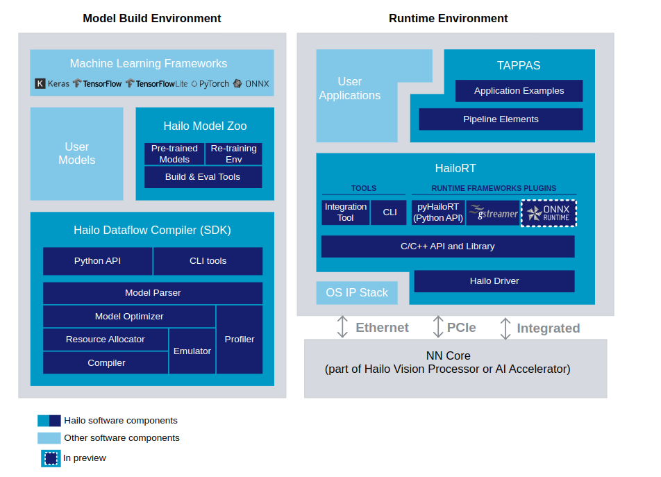
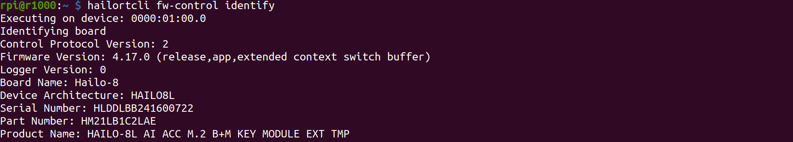
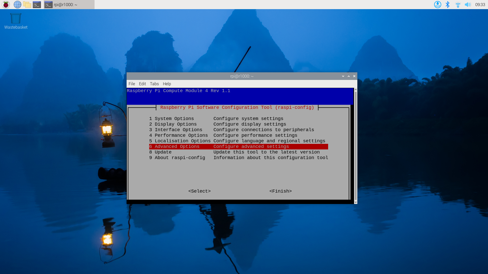

# Introduction to Hailo in Raspberry Pi Environment

## What is Hailo?

[Hailo](https://hailo.ai/) offers cutting-edge AI processors uniquely tailored for high-performance deep learning applications on edge devices. The company's solutions focus on enabling the next era of generative AI on the edge, alongside perception and video enhancement, powered by advanced AI accelerators and vision processors.

### Key Features:
- **Hailo-8 NPU Dataflow Architecture**
- Differs from the traditional Von Neumann architecture.
- Implements a distributed memory fabric combined with pipeline elements for low-power memory access.

###  Architecture -Hailo AI Software Suite Overview

The **Hailo AI Software Suite** provides powerful tools to run AI models efficiently on hardware accelerators. It is designed to integrate seamlessly with existing deep learning frameworks, offering smooth workflows for developers.



The process involves generating a HEF (Hailo Executable Binary File) from an ONNX file in the Model Build Environment. Once created, the HEF file is transferred to the inference machine (Runtime Environment), where it is used to execute inference with the HailoRT API. The provided script facilitates the conversion of an ONNX file into a HEF file within the Model Build Environment.We will discuss futher more on 5th chapter. 

### Hailo Dataflow Compiler (DFC)
The Hailo Dataflow Compiler (DFC) enables users to integrate AI models into their projects with ease. It is compatible with popular frameworks like TensorFlow Lite (TFLite) and ONNX, allowing conversion and compilation of models into the Hailo HEF format, optimized for running on Hailo AI accelerators. The DFC enhances the performance of devices like the Raspberry Pi AI Kit, making them adaptable to specific use cases. To access the DFC, users need to create an account on the Hailo website and download the latest version.


### Runtime Software Suite

The **Hailo Runtime (HailoRT)** is a production-grade, lightweight, and scalable runtime software. It provides a robust library with intuitive APIs for optimized performance and supports building fast pipelines for AI applications. HailoRT operates on the Hailo AI Vision Processor or the host processor when using the Hailo AI Accelerator. This ensures high-throughput inferencing with one or more Hailo devices. Standard framework support includes **GStreamer** and **ONNX Runtime**, simplifying integration with existing AI workflows.

### Hailo Model Zoo
The **Hailo Model Zoo** offers a collection of pre-trained deep learning models for various computer vision tasks, enabling rapid prototyping on Hailo devices. These models come with binary HEF files fully supported by the Hailo toolchain. Developers can explore the **Hailo Model Zoo GitHub repository**, which includes common models and architectures, along with resources to replicate Hailo's published performance.

References: Check their [**GitHub repository**](https://github.com/hailo-ai/hailo_model_zoo) for the most updated details.


## Hardware Preparation

### Raspberry Pi AI Kit


  
[**Purchase Now**](https://www.seeedstudio.com/Raspberry-Pi-AI-Kit-p-5900.html?utm_source=PiAICourse&utm_medium=github&utm_campaign=Course)


The Raspberry Pi AI Kit is designed to elevate edge IoT devices with Hailo AI capabilities. It includes:
- **13 TOPS Performance** High AI processing power.
- **Effective Heat Dissipation** Ensures stable operation.
- **Modular Design** Compatible with Raspberry Pi 5, CM4-powered IoT gateways, and controllers with M.2 slots.

Additional Resources: Read the following article to learn how to connect your Raspberry Pi 5:  
[Raspberry Pi AI Kit Documentation](https://www.raspberrypi.com/documentation/accessories/ai-kit.html)

### AI HAT+ (26 TOPS)


  
[**Purchase Now**](https://www.seeedstudio.com/Raspberry-Pi-Al-HAT-26-TOPS-p-6243.html)


- **Built-in Hailo AI Accelerator** Offers 26 TOPS of AI performance.
- **PCIe Gen 3 Communication** Harnesses Raspberry Pi 5's PCIe Gen 3 interface for optimal throughput.
- **Post-efficient & Power-efficient** High performance without breaking the bank.

### reComputer AI R2130-12

  
[**Purchase Now**](https://www.seeedstudio.com/reComputer-AI-R2130-12-p-6368.html)

- **Compact Design**: Optimized thermal architecture suitable for deployment in resource-constrained environments.  
- **Performance** 26 Tera-Operations Per Second (TOPS), powered by the Hailo AI Accelerator.  
- **Connectivity** 
  - 2x HDMI 4Kp60.  
  - 1x Ethernet Port.  
  - 2x USB 3.0.  
  - 2x USB 2.0.  
- **Expandability**: PCIe 2.0 dual M.2 slot supports both AI accelerators and SSD storage.  

## Installing Hailo Software on Raspberry Pi 5

### Step 1: Update the System

```bash
sudo apt update
sudo apt full-upgrade
```

### Step 2: Configure PCIe Settings

```bash 
# Enable the PCIe external connector
dtparam=pciex1

# Force Gen 3.0 speeds (optional, comment to use Gen 2)
dtparam=pciex1_gen=3

```

### Step 3: Install Hailo Software

```bash 
sudo apt install hailo-all
sudo reboot

```

### Step 4: Verify Installation


- Check software and firmware installation:

```bash
hailortcli fw-control identify

```


- Verify the Hailo-8L connection

```bash
lspci | grep Hailo

```


## Installing Hailo Software on reComputer R1000

### Step 1: Update System and Configure PCIe to Gen 3

#### Update System

- Open a terminal on the reComputer R1000.
- Run the following commands to update your system.

```bash 
sudo apt update   
sudo apt full-up
```

#### Configure PCIe to Gen 3

- Open the Raspberry Pi configuration tool:


```bash 
sudo raspi-config
```

- Navigate to **6 Advanced Options**



- Next A8 PCIe Speed 


- Choose **Yes** to enable PCIe Gen 3 mode. 
- Click **Finish** to exit the configuration.

### Step 2: Install Hailo Software

- Install the Hailo software by running

```bash
sudo apt install hailo-all  
sudo reboot 
```

- Verify the installation:  

```bash
hailortcli fw-control identify
```
- Check if the Hailo-8L is connected

```bash
lspci | grep Hailo 
```
In this chapter, we have discussed how to set up the Raspberry Pi for your AI project. In the next chapter, we will discuss how to run a pretrained model as well as how to use your custom data model.


