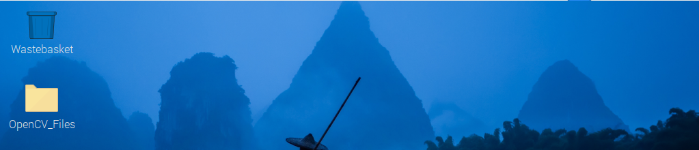
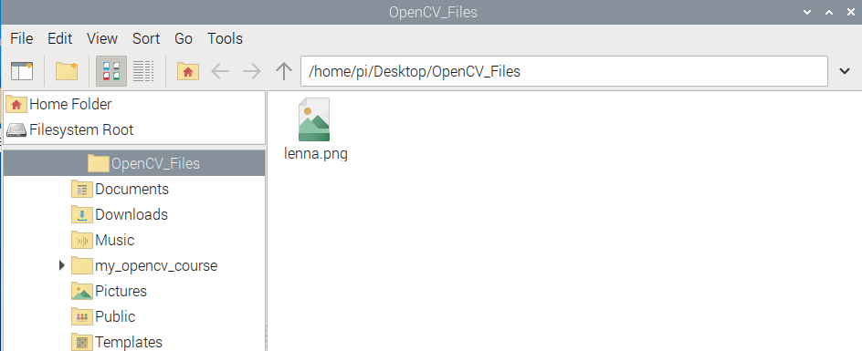
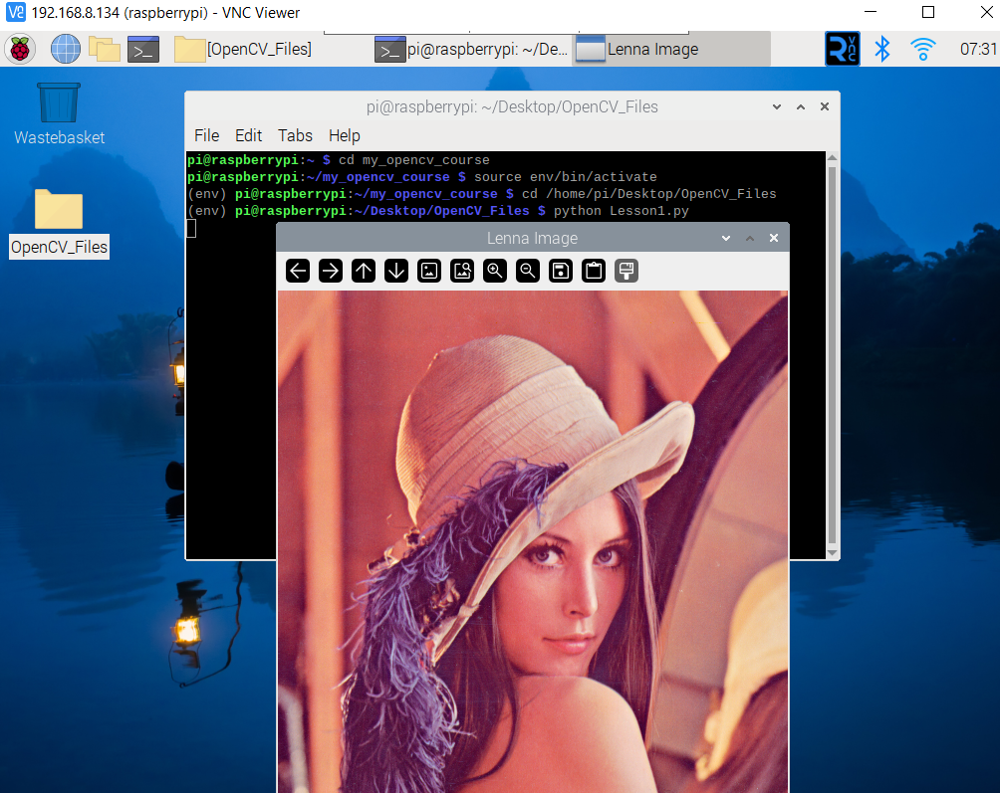
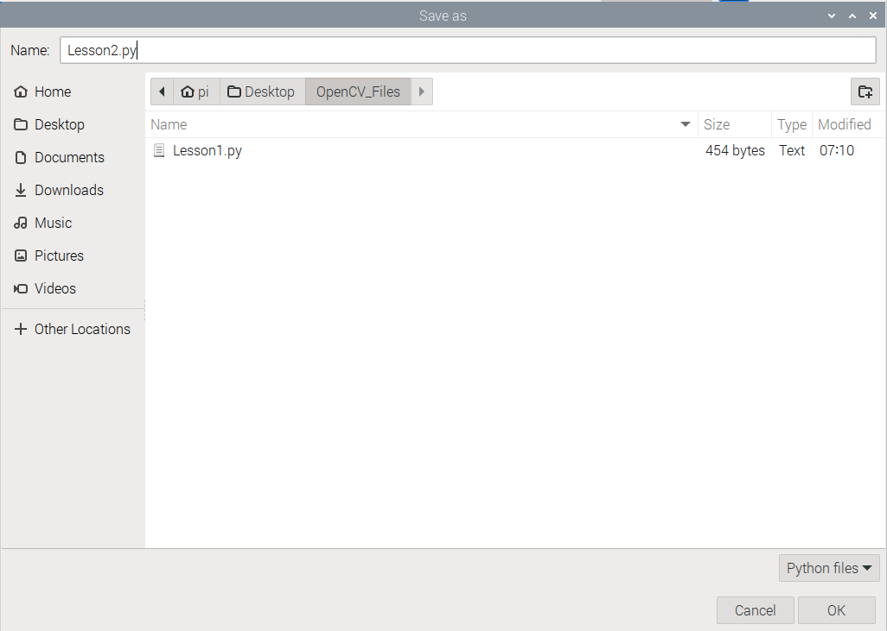
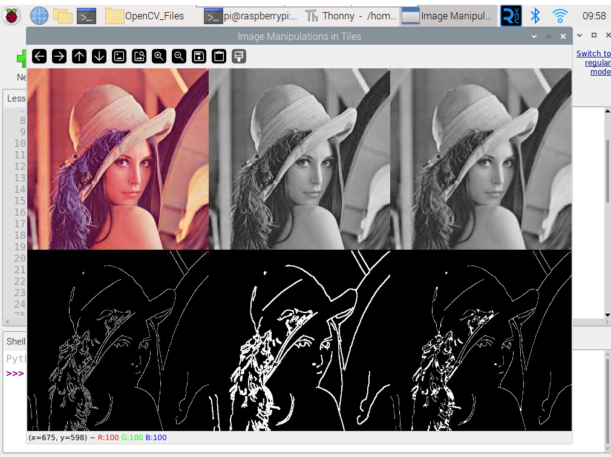
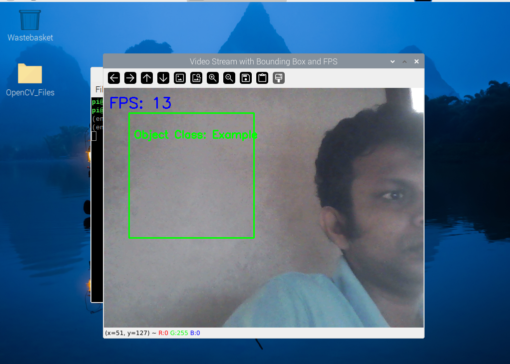

# Introduction to OpenCV in Raspberry Pi Environment

## Introduction 

OpenCV (Open Source Computer Vision Library) is a powerful open-source library used for real-time computer vision and image processing tasks. It provides tools for tasks like object detection, face recognition, image manipulation, and video analysis, and is widely used in applications such as surveillance, robotics, and augmented reality.
In this course, we will install OpenCV on a Raspberry Pi environment and explore the basics of image manipulations, **such as reading and writing images/video feed, applying filters, and detecting shapes. OpenCV is widely used for real-time computer vision tasks, enabling projects like object detection, face recognition, and video analysis.**

## Installation 

Here’s the step-by-step process for installing OpenCV on a Raspberry Pi 5 environment running the latest 64-bit OS (Bookworm distribution)

**Step 01: Create a Directory for the Course**

First, let's create a directory called my_opencv_course and navigate into it:

```bash
mkdir my_opencv_course
cd my_opencv_course
```

**Step 02: Create a Virtual Environment**

In this directory, create a virtual environment using the following command:

```bash
python -m venv --system-site-packages env
```

**Step 03: Activate the Virtual Environment**

Now, activate the virtual environment:

```bash
source env/bin/activate
```
**Step 04 :Install OpenCV**

```bash
pip3 install opencv-contrib-python
```

**Step 05: Verify the Installation**

To confirm that OpenCV has been installed correctly, run the following in Python:


```bash
python
```
Then, within the Python interpreter:

```bash
import cv2
print(cv2.__version__)
```

If the version prints successfully (e.g., 4.10.x), then OpenCV has been installed properly.


## Read an Image 

**Step 01: Create a new Folder on Desktop. This case I used file name as OpenCV_Files**



**Step 02: Place the image file lenna.png inside this folder.**



**Step 03: Open the Python interpreter.**


**Step 04: Write the following code to read and display the image. Save it as Lesson1.py on OpenCV_Files folder**


```bash
import cv2
import os

# Define the path to the image
image_path = os.path.expanduser('/home/pi/Desktop/OpenCV_Files/lenna.png')

# Read the image
image = cv2.imread(image_path)

# Check if the image was loaded correctly
if image is None:
    print("Error: Image not found!")
else:
    # Display the image in a window
    cv2.imshow('Lenna Image', image)

    # Wait for a key press and then close the window
    cv2.waitKey(0)
    cv2.destroyAllWindows()

```

**Step  05: Go to Terminal and activate the virtual environment that we created.**

```bash
cd my_opencv_course
source env/bin/activate
```

Step  06: Navigate the folder that you saved python file. 

```bash
cd /home/pi/Desktop/OpenCV_Files
```
Step 07: Run the python script

```bash
python Lesson1.py
```


Press any key to exit the image view. Congratulations! Now you know how to read an image.


## Capturing Video Feed from a USB Camera using OpenCV

**Step 1: Plug in the USB Camera**

**Step 2: Verify the Camera is Detected**

Open the terminal and run the following command 

```bash
ls /dev/video*
```


**Step 3: Write the Python Script to Capture Video Feed.**
Open Thonny or a text editor and create a new Python script. 

```bash
import cv2

# Capture video feed from the first connected camera (USB)
cap = cv2.VideoCapture(0)

# Check if the camera opened successfully
if not cap.isOpened():
    print("Error: Could not open camera.")
else:
    while True:
        # Read a frame from the camera
        ret, frame = cap.read()

        # If the frame is read successfully, display it
        if ret:
            cv2.imshow('USB Camera Feed', frame)

        # Press 'q' to exit the video feed window
        if cv2.waitKey(1) & 0xFF == ord('q'):
            break

    # Release the camera and close the window
    cap.release()
    cv2.destroyAllWindows()

```
**Step 04: Save it as Lesson2.py on OpenCV_Files folder**



**Step  05: Go to Terminal and activate the virtual environment that we created.**

```bash
cd my_opencv_course
source env/bin/activate
```

**Step  06: Navigate the folder that you saved python file.**

```bash
cd /home/pi/Desktop/OpenCV_Files
```

**Step 07: Run the python script**

```bash
python Lesson2.py
```


## Basic Image Manipulations

**What is Image Manipulation?**

Image manipulation refers to the process of altering or analyzing images to achieve certain objectives such as enhancing visual quality, detecting objects, or extracting meaningful information. By transforming images through various techniques, we can simplify their representation and prepare them for tasks like object recognition, edge detection, or machine learning applications. Image manipulation is crucial in fields like medical imaging, computer vision, and digital media.

**Why is Image Manipulation Important?**

Image manipulations are fundamental because they allow computers to understand and process visual information more effectively. Operations like filtering, detecting edges, or adjusting pixel intensity help simplify the complexity of images, making it easier to detect objects, shapes, or features. These techniques are the building blocks for advanced applications such as face recognition, autonomous vehicles, and smart surveillance systems.


**Common Image Manipulation Methods:**

- 1.**Grayscale Conversion**: Converts an image from color (RGB) to grayscale, simplifying the data by removing color information and focusing only on intensity levels. This is useful for reducing computational complexity and is often a preprocessing step for further analysis like edge detection.

- 2.**Blurring and Edge Detection (Canny)**: Blurring smooths an image, reducing noise and detail, while edge detection (like the Canny method) identifies sharp changes in intensity, marking the boundaries of objects in an image.

- 3.**Dilation and Erosion**: Morphological operations that modify the shape of objects in binary or grayscale images. Dilation expands object boundaries, making features more prominent, while erosion shrinks boundaries, removing noise or small features.

**Step 01: Write the following code to read and display the image. Save it as Lesson3.py on OpenCV_Files folder**

```bash
import cv2
import numpy as np

# Load the image
image_path = '/home/pi/Desktop/OpenCV_Files/lenna.png'
image = cv2.imread(image_path)

# Function to resize the images to the same width and height
def resize_image(image, width=300, height=300):
    return cv2.resize(image, (width, height))

# Grayscale Conversion
gray_image = cv2.cvtColor(image, cv2.COLOR_BGR2GRAY)

# Blurring the image (Gaussian Blur)
blurred_image = cv2.GaussianBlur(gray_image, (5, 5), 0)

# Edge Detection (Canny)
edges = cv2.Canny(blurred_image, 100, 200)

# Dilation and Erosion
dilated_image = cv2.dilate(edges, np.ones((3, 3), np.uint8), iterations=1)
eroded_image = cv2.erode(dilated_image, np.ones((3, 3), np.uint8), iterations=1)

# Resize the images
resized_original = resize_image(image)
resized_gray = resize_image(gray_image)
resized_blur = resize_image(blurred_image)
resized_edges = resize_image(edges)
resized_dilate = resize_image(dilated_image)
resized_erode = resize_image(eroded_image)

# Stack images into a grid (2 rows and 3 columns)
# Convert grayscale images to BGR so they can be tiled with color images
resized_gray_bgr = cv2.cvtColor(resized_gray, cv2.COLOR_GRAY2BGR)
resized_blur_bgr = cv2.cvtColor(resized_blur, cv2.COLOR_GRAY2BGR)
resized_edges_bgr = cv2.cvtColor(resized_edges, cv2.COLOR_GRAY2BGR)
resized_dilate_bgr = cv2.cvtColor(resized_dilate, cv2.COLOR_GRAY2BGR)
resized_erode_bgr = cv2.cvtColor(resized_erode, cv2.COLOR_GRAY2BGR)

# Create a grid of images (tiles)
top_row = np.hstack((resized_original, resized_gray_bgr, resized_blur_bgr))
bottom_row = np.hstack((resized_edges_bgr, resized_dilate_bgr, resized_erode_bgr))

# Combine the two rows into one final image
final_image = np.vstack((top_row, bottom_row))

# Display the final tiled image
cv2.imshow("Image Manipulations in Tiles", final_image)

# Wait for any key press to close
cv2.waitKey(0)
cv2.destroyAllWindows()

```

**Step  02: Go to Terminal and activate the virtual environment that we created.**

```bash
cd my_opencv_course
source env/bin/activate
```

**Step  03: Navigate the folder that you saved python file.**

```bash
cd /home/pi/Desktop/OpenCV_Files
```

**Step 04: Run the python script**

```bash
python Lesson3.py
```



Press q to exit. 

**Exercise: Experiment with Image Manipulation Parameters**

Change the parameters of each function to explore how they affect the image manipulation. For example, try changing the kernel size in cv2.GaussianBlur() from (5, 5) to (3, 3) and observe the differences in the blurred image.

**Suggestions**
- Grayscale Conversion: You can experiment with different color spaces by using cv2.COLOR_BGR2HSV or cv2.COLOR_BGR2LAB instead of cv2.COLOR_BGR2GRAY.
- Blurring: Modify the kernel size (e.g., from (5, 5) to (3, 3)) in cv2.GaussianBlur() to see how the image becomes more or less blurred.
- Edge Detection (Canny): Adjust the thresholds (e.g., from 100, 200 to 50, 150) to make the edge detection more or less sensitive.
- Dilation and Erosion: Try different kernel sizes in cv2.dilate() and cv2.erode() (e.g., use a larger kernel like 5x5) to see how the object boundaries change.
  
## Drawing on A image 

In object detection, you often see bounding boxes highlighting detected objects, along with the class name and probability score. OpenCV allows you to easily add shapes like rectangles and overlay text onto video frames or images. This is useful for visualizing real-time detection results, such as displaying the FPS or labeling objects. Here's how you can draw a rectangle and add text, like FPS, on a live video feed using OpenCV.

**Step 01: Write the following code to read and display the image. Save it as Lesson3.py on OpenCV_Files folder**

```bash
import cv2
import time

# Capture video feed from the first camera (USB or internal)
cap = cv2.VideoCapture(0)

# Get the starting time for FPS calculation
prev_frame_time = 0

# Infinite loop for continuous video feed
while True:
    # Capture the video frame-by-frame
    ret, frame = cap.read()

    # Check if the frame was successfully captured
    if not ret:
        print("Error: Unable to capture video.")
        break

    # Get the current time for FPS calculation
    new_frame_time = time.time()

    # Calculate the FPS (frames per second)
    fps = 1 / (new_frame_time - prev_frame_time)
    prev_frame_time = new_frame_time

    # Convert FPS to an integer
    fps = int(fps)

    # Convert FPS to a string
    fps_text = f"FPS: {fps}"

    # Draw a rectangle on the frame
    # Arguments: frame, start_point, end_point, color (BGR), thickness
    cv2.rectangle(frame, (50, 50), (300, 300), (0, 255, 0), 2)

    # Add text inside the rectangle
    cv2.putText(frame, "Object Class: Example", (60, 100), cv2.FONT_HERSHEY_SIMPLEX, 0.7, (0, 255, 0), 2)

    # Add FPS text at the top of the frame
    cv2.putText(frame, fps_text, (10, 40), cv2.FONT_HERSHEY_SIMPLEX, 1, (255, 0, 0), 2)

    # Display the resulting frame
    cv2.imshow('Video Stream with Bounding Box and FPS', frame)

    # Press 'q' to quit the video feed
    if cv2.waitKey(1) & 0xFF == ord('q'):
        break

# Release the video capture object and close all windows
cap.release()
cv2.destroyAllWindows()

```
**Step  02: Go to Terminal and activate the virtual environment that we created.**

```bash
cd my_opencv_course
source env/bin/activate
```
**Step  03: Navigate the folder that you saved python file.** 

```bash
cd /home/pi/Desktop/OpenCV_Files
```

**Step 04: Run the python script**


```bash
python Lesson4.py
```



