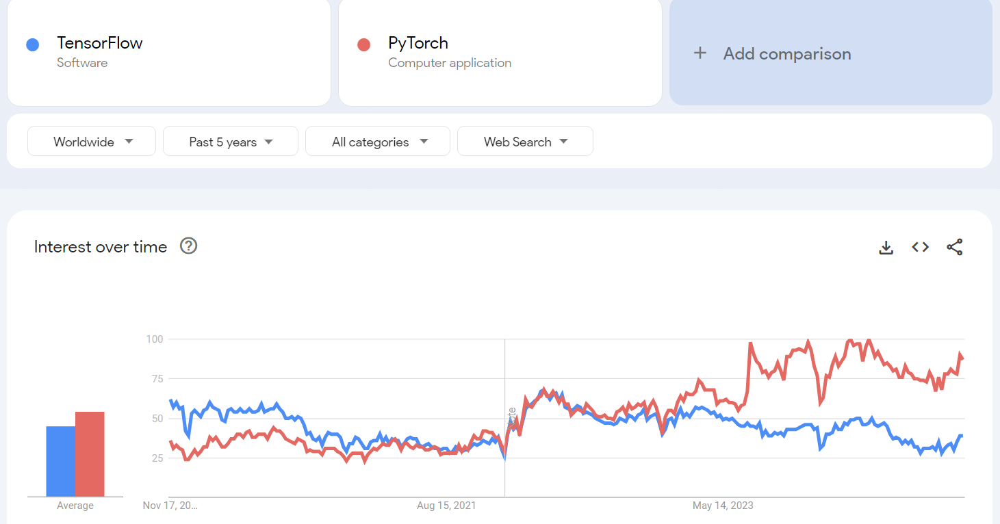
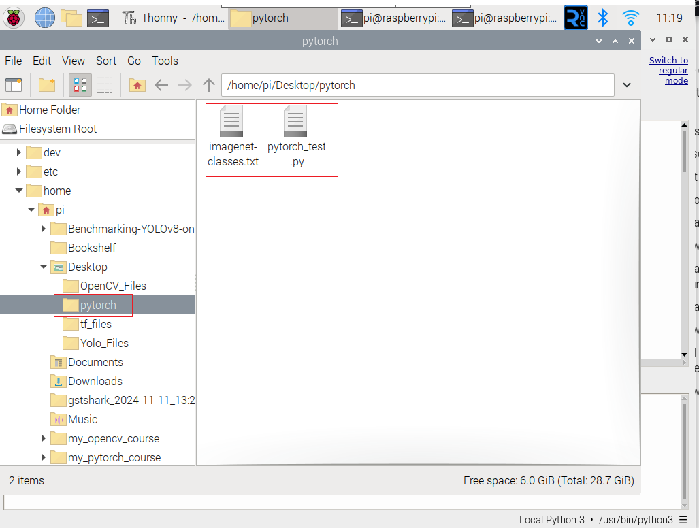
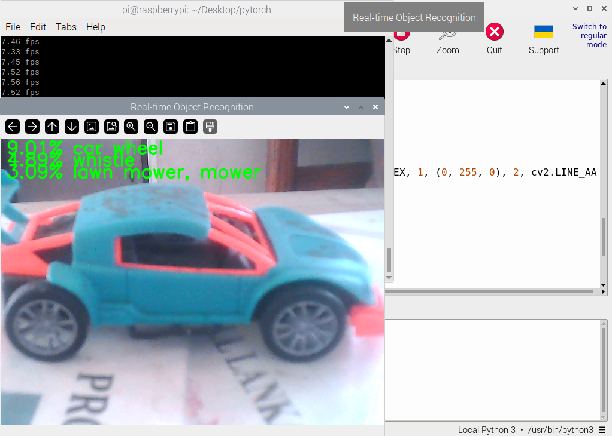

# Introduction to Pytorch in Raspberry Pi Environment


## What is PyTorch?


PyTorch is an open-source machine learning framework developed by Facebook's AI Research lab (FAIR). It is known for its flexibility, dynamic computation graphs, and strong community support. PyTorch simplifies the development of deep learning models, making it a popular choice for researchers and practitioners alike.


### Brief History

- **2016**: PyTorch was released by Facebook as an open-source library, combining features of Torch (a Lua-based framework) and Python for easy usability.
  
- **2019**: Gained significant momentum when Facebook partnered with Microsoft to create ONNX (Open Neural Network Exchange) for model interoperability.
  
- **2022**: PyTorch became part of the PyTorch Foundation, ensuring community-driven development.

### Why Use PyTorch?

- **Dynamic Graphs**: PyTorch uses dynamic computation graphs, allowing flexibility in building and debugging models.
  
- **Pythonic**: Integrates seamlessly with Python, making it intuitive for Python developers.
  
- **Community Support**: A vibrant ecosystem with numerous tutorials, forums, and open-source projects.
  
- **Accelerated Research**: Its ease of use accelerates model experimentation and implementation.

### What Are Dynamic Computation Graphs?

- A computation graph represents the operations performed on data (e.g., tensors) in a deep learning model.
- Dynamic Graphs (PyTorch):The computation graph is built on the fly as operations are executed.
  - Each forward pass can construct a different graph, allowing for greater flexibility and adaptability.
  - You don’t need to define the entire graph beforehand; it evolves during runtime.

### Who Uses PyTorch?

- **Research Organizations**: MIT, Stanford, OpenAI, and FAIR.
  
- **Companies**: Facebook (Meta), Tesla (autonomous driving), Disney (AI for animation), and Microsoft.

- **Domains**: Used in computer vision, natural language processing, reinforcement learning, and more.


## PyTorch vs TensorFlow: Feature Comparison




## PyTorch vs TensorFlow: Feature Comparison

| **Feature**              | **PyTorch**                                 | **TensorFlow**                               |
|--------------------------|---------------------------------------------|---------------------------------------------|
| **Computation Graph**    | Dynamic (easier for debugging)             | Static (optimized for deployment)           |
| **Ease of Use**          | Intuitive and Pythonic                     | Requires a steeper learning curve           |
| **Community**            | Popular in academia and research           | Widely used in production and enterprises   |
| **Frameworks Built On**  | Lightning, Detectron2, Hugging Face        | Keras, TFX, TensorFlow Lite                 |
| **Deployment**           | TorchServe, ONNX                           | TensorFlow Serving, TensorFlow.js           |
| **Performance**          | Efficient but depends on optimization      | Better optimization for large-scale tasks   |

## What is QNNPACK?

QNNPACK (Quantized Neural Network PACKage) is a high-performance kernel library developed by Facebook for running quantized neural networks efficiently on ARM CPUs. It is optimized for low-power devices, such as mobile phones and Raspberry Pi, and is a critical component for executing PyTorch's quantized models. It supports operations like convolutions, fully connected layers, and more, tailored for low-precision inference.


## Setting Up the Environment for PyTorch Classification

**Create a Virtual Environment**

```bash
mkdir my_pytorch_course
cd my_pytorch_course
python -m venv --system-site-packages env
source env/bin/activate
```

**Install Required Libraries**

```bash
pip install torch torchvision torchaudio opencv-python numpy
```
**Prepare Your Directory**

- Create a folder on your Desktop named pytorch.
- Inside the pytorch folder, create the following files:
  - pytorch_test.py (for your Python code).
  - imagenet-classes.txt (contains ImageNet class labels).



## Python Code (pytorch_test.py)

Copy the provided Python code into the file pytorch_test.py:


```bash
import time

import torch
import numpy as np
from torchvision import models, transforms

import cv2
from PIL import Image

torch.set_num_threads(torch.get_num_threads())

# Ensure qnnpack backend is used for quantized models
torch.backends.quantized.engine = 'qnnpack'

# Load the ImageNet class labels
with open("imagenet-classes.txt", "r") as f:
    classes = [line.strip() for line in f.readlines()]

# Initialize webcam
cap = cv2.VideoCapture(0, cv2.CAP_V4L2)
cap.set(cv2.CAP_PROP_FRAME_WIDTH, 224)
cap.set(cv2.CAP_PROP_FRAME_HEIGHT, 224)
cap.set(cv2.CAP_PROP_FPS, 36)

# Preprocessing pipeline
preprocess = transforms.Compose([
    transforms.ToTensor(),
    transforms.Normalize(mean=[0.485, 0.456, 0.406], std=[0.229, 0.224, 0.225]),
])

# Load MobileNetV2 quantized model
net = models.quantization.mobilenet_v2(pretrained=True, quantize=True)
net = torch.jit.script(net)  # Optimize model for inference

# Performance logging
started = time.time()
last_logged = time.time()
frame_count = 0

# Real-time inference
with torch.no_grad():
    while True:
        # Read frame from webcam
        ret, frame = cap.read()
        if not ret:
            print("Failed to capture frame. Exiting...")
            break

        # Convert BGR to RGB
        image = cv2.cvtColor(frame, cv2.COLOR_BGR2RGB)

        # Preprocess image
        input_tensor = preprocess(image)
        input_batch = input_tensor.unsqueeze(0)

        # Perform inference
        output = net(input_batch)
        probabilities = output[0].softmax(dim=0)

        # Get top-10 predictions
        top = list(enumerate(probabilities))
        top.sort(key=lambda x: x[1], reverse=True)
        top_predictions = [(classes[idx], val.item()) for idx, val in top[:3]]

        # Display predictions on the frame
        for i, (label, prob) in enumerate(top_predictions):
            text = f"{prob * 100:.2f}% {label}"
            cv2.putText(frame, text, (10, 25 + i * 20), cv2.FONT_HERSHEY_SIMPLEX, 1, (0, 255, 0), 2, cv2.LINE_AA)

        # Show the frame
        cv2.imshow("Real-time Object Recognition", frame)

        # Log fps
        frame_count += 1
        now = time.time()
        if now - last_logged > 1:
            print(f"{frame_count / (now - last_logged):.2f} fps")
            last_logged = now
            frame_count = 0

        # Exit on pressing 'q'
        if cv2.waitKey(1) & 0xFF == ord('q'):
            break

# Release resources
cap.release()
cv2.destroyAllWindows()


```
## How to Run the Code

**Navigate to the pytorch directory**

```bash
cd /home/pi/Desktop/pytorch
```

**Run the Python script**

```bash
python pytorch_test.py
```

**Check Output**

A window will open showing the real-time webcam feed.The top-3 predictions (with confidence percentages) will be displayed on the video feed.



Futher references :

[Pytorch Documentation](https://pytorch.org/docs/stable/index.html)

[Pytorch Course](https://www.learnpytorch.io/)


