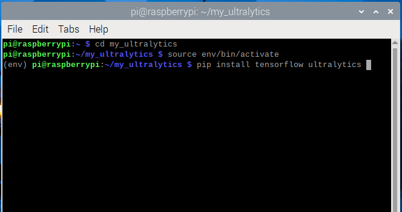

# Introduction to Ultralytics in Raspberry Pi Environment

## Who is Ultralytics?


[Ultralytics](https://www.ultralytics.com/) is a company and open-source organization known for developing YOLOv5 and YOLOv8,YOLO11 popular deep learning models for real-time object detection. YOLO, short for "You Only Look Once," is a family of object detection models designed for high-speed, accurate detection in images and video. Ultralytics has made significant contributions to YOLO by optimizing its models for both performance and accessibility, making it popular in applications like surveillance, autonomous vehicles, robotics, and more.

Ultralytics offers a diverse suite of models designed for specialized tasks such as **object detection, instance segmentation, image classification, pose estimation, and multi-object tracking.**
**YOLO11** Ultralytics’ latest YOLO series delivers state-of-the-art (SOTA) performance across various tasks.

In this tutorial, we’ll explore deploying YOLO11 on a Raspberry Pi. In the next tutorial, we’ll dive into how to harness this remarkable architecture using the Hailo Accelerator.


## Ultralytics on Raspberry Pi Environment


### Step 1: Train and Export the Model

**Ultralytics** provides the **COCO dataset** labels, which can be used to train the model. Initially, the model weights are provided in .pt format. To use the model on resource-constrained devices like the Raspberry Pi, we need to convert the weights into a quantized format.
For this, you can use the following Colab code to convert the model to a **TensorFlow Lite (TFLite)** format. In this case, we will train the **YOLO11n** model with an image size of 224x224, and then convert the trained model into the TFLite format for efficient deployment on the Raspberry Pi.


<a target="_blank" href="https://colab.research.google.com/github/Seeed-Projects/Tutorial-of-AI-Kit-with-Raspberry-Pi-From-Zero-to-Hero/blob/main/notebook/Chapter2/yolov11n_to_convert_tflite.ipynb">
  
</a>


After running each cell in the Colab notebook, you'll generate two TFLite model files: one with 32-bit floating-point precision and the other with 16-bit precision. You can test either of these, but for this example, we will proceed with the 16-bit floating-point model. Download this file to continue.


Let's Go to Raspberry Pi 

### Step 2: Set Up a Project Directory

```bash
mkdir my_ultralytics
cd my_ultralytics
```

### Step 3: Create a Virtual Environment and Activate the virtual environment

```bash
python -m venv --system-site-packages env
source env/bin/activate
```

### Step 4: Install Required Libraries

```bash
pip install ultralytics tensorflow
sudo reboot
```



### Step 5: Set Up the Code

**Open Thonny Python IDE** and paste the following code snippet. Save the file on your desktop in a folder named `Yolo_Files` with the filename `test_yolo_coco.py`:

```bash
import cv2
import time
from ultralytics import YOLO

# Load COCO class names
with open("coco.txt", "r") as f:
    class_names = f.read().splitlines()

# Load the YOLOv8 model (TFLite version)
model = YOLO("best_float16.tflite")

# Open the webcam
cap = cv2.VideoCapture(0)
count = 0

# Initialize variables for FPS calculation
prev_time = 0

while True:
    ret, frame = cap.read()
    if not ret:
        break

    count += 1
    if count % 3 != 0:
        continue

    current_time = time.time()

    # Run YOLOv8 detection on the frame
    results = model(frame, conf=0.7, imgsz=224)

    for result in results:
        boxes = result.boxes
        for box in boxes:
            x1, y1, x2, y2 = map(int, box.xyxy[0])
            confidence = box.conf[0]
            class_id = int(box.cls[0])
            class_name = class_names[class_id]

            # Draw the bounding box
            cv2.rectangle(frame, (x1, y1), (x2, y2), (0, 255, 0), 2)

            # Label the detection
            label = f'{class_name} {confidence:.2f}'
            cv2.putText(frame, label, (x1, y1 - 5), cv2.FONT_HERSHEY_SIMPLEX, 0.5, (0, 0, 0), 2)

    # Calculate and display FPS
    fps = 1 / (current_time - prev_time)
    prev_time = current_time
    cv2.putText(frame, f'FPS: {fps:.2f}', (10, 30), cv2.FONT_HERSHEY_SIMPLEX, 1, (0, 255, 0), 2)

    # Display the frame
    cv2.imshow("Webcam", frame)
    if cv2.waitKey(1) & 0xFF == ord("q"):
        break

cap.release()
cv2.destroyAllWindows()

```
### Step 6: Download the Necessary Files

Save the following files in the Yolo_Files folder

- **best_float16.tflite**: [The TFLite mode](../../models/Chapter2/best_float16.tflite) file.
- **coco.txt**: A text file containing the [COCO dataset labels](../../models/Chapter2/coco.txt).


### Step 7: Activate the virtual Environment

```bash
cd my_ultralytics
source env/bin/activate
```

### Step 8: Run the YOLOv8 Model

Navigate to the Yolo_Files folder and Run the Python script

```bash
cd /home/pi/Desktop/Yolo_Files
python test_yolo_coco.py
```


Press `q` to quit the application while it’s running.

You may notice a slight delay in the FPS (frames per second) while running this model, as it relies on the Raspberry Pi’s CPU for inference. CPU-only mode can limit real-time performance, making it challenging for tasks that require quick responsiveness. This is where the **Hailo accelerator** (the AI Kit for Raspberry Pi) becomes essential, offering optimized processing that enhances real-time performance for applications like object detection, tracking, and other AI-driven tasks.

## Other Resources

[Quick Start Guide: Raspberry Pi with Ultralytics YOLO11](https://docs.ultralytics.com/guides/raspberry-pi/)
[Model Export with Ultralytics YOLO](https://docs.ultralytics.com/modes/export/)
[A Guide on YOLO11 Model Export to TFLite for Deployment](https://docs.ultralytics.com/integrations/tflite/#deployment-options-in-tflite)


