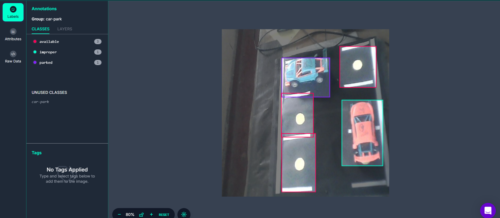
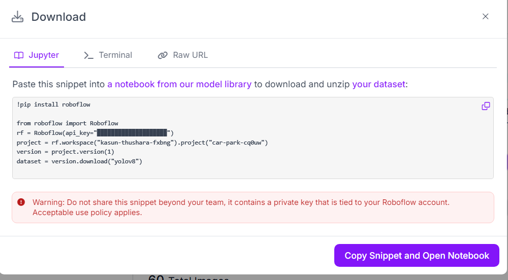

# Car Park Solution Management with ThingsBoard

This project delivers a custom model for detecting parking possibilities in a car park. The system identifies three classes: available slots, parked slots, and improper parking.

The model was trained using the YOLOv8n framework and deployed on a Raspberry Pi with a Hailo-8L accelerator. The modified code enables real-time parking slot counting and sends MQTT messages to the ThingsBoard IoT platform.

ThingsBoard provides an intuitive interface for data visualization and analysis, making it easy to monitor parking conditions and optimize management.

## Step 1: Data Collection and Labeling

We created a small prototype of a car park to demonstrate the working phenomenon. Using a webcam connected to a Raspberry Pi, we collected images of the parking area. These images were then uploaded to a Roboflow repository for further processing.

The images were labeled into three distinct classes:

- Available
- Parked
- Improper




You can view the project here: [Car Park - Roboflow Repository](https://app.roboflow.com/kasun-thushara-fxbng/car-park-cq0uw/1)

## Step 2: Model Training

We trained a YOLOv8n model using a custom dataset. Roboflow provides a downloadable link for the dataset, which can be used to train the model with YOLOv8n.



 After training, the model must be exported to the ONNX format for deployment.

Detailed instructions on model labeling and training can be found in Chapter 5

[How to training the model](https://seeed-projects.github.io/Tutorial-of-AI-Kit-with-Raspberry-Pi-From-Zero-to-Hero/docs/Chapter_5-Custom_Model_Development_and_Deployment/Training_Your_Model)

[How to convert ONNX model to HEF](https://seeed-projects.github.io/Tutorial-of-AI-Kit-with-Raspberry-Pi-From-Zero-to-Hero/docs/Chapter_5-Custom_Model_Development_and_Deployment/Convert_Your_Model)

## Step 3: Deploy the Model

On the Raspberry Pi, after installing Hailo tools, you can test if the detection is working correctly. For MQTT connection, ensure you install the required dependencies in the same virtual environment:

```bash
sudo apt update
sudo apt install -y mosquitto mosquitto-clients
pip install paho-mqtt
```
We modified the detection_pipeline.py script and renamed it as park_object_detection.py. Below is the modified code:

```bash
import gi
gi.require_version('Gst', '1.0')
from gi.repository import Gst, GLib
import os
import numpy as np
import cv2
import hailo
import paho.mqtt.client as mqtt
import json
from hailo_rpi_common import (
    get_caps_from_pad,
    get_numpy_from_buffer,
    app_callback_class,
)
from detection_pipeline import GStreamerDetectionApp

# -----------------------------------------------------------------------------------------------
# User-defined class to be used in the callback function
# -----------------------------------------------------------------------------------------------
class user_app_callback_class(app_callback_class):
    def __init__(self):
        super().__init__()
        self.detection_counts = {
            "available": 0,
            "parked": 0,
            "improper": 0
        }

    def reset_counts(self):
        self.detection_counts = {key: 0 for key in self.detection_counts}

# -----------------------------------------------------------------------------------------------
# MQTT Setup
# -----------------------------------------------------------------------------------------------
BROKER = "192.168.8.195"  # Replace with your MQTT broker's IP address
CLIENT_ID = "Car_Park"
PORT = 1883
TOPIC = "v1/devices/me/telemetry"  # Adjust to match your topic

mqtt_client = mqtt.Client(CLIENT_ID)

def setup_mqtt():
    mqtt_client.connect(BROKER, PORT, 60)
    mqtt_client.loop_start()

def publish_counts(detection_counts):
    payload = json.dumps(detection_counts)  # Convert counts to JSON format
    mqtt_client.publish(TOPIC, payload, qos=1)
    print(f"Published: {payload} to topic {TOPIC}")

# -----------------------------------------------------------------------------------------------
# User-defined callback function
# -----------------------------------------------------------------------------------------------
def app_callback(pad, info, user_data):
    buffer = info.get_buffer()
    if buffer is None:
        return Gst.PadProbeReturn.OK

    user_data.reset_counts()
    roi = hailo.get_roi_from_buffer(buffer)
    detections = roi.get_objects_typed(hailo.HAILO_DETECTION)

    for detection in detections:
        label = detection.get_label()
        if label in user_data.detection_counts:
            user_data.detection_counts[label] += 1

    publish_counts(user_data.detection_counts)
    print(f"Detection Counts: {user_data.detection_counts}")

    return Gst.PadProbeReturn.OK

# -----------------------------------------------------------------------------------------------
# Main
# -----------------------------------------------------------------------------------------------
if __name__ == "__main__":
    setup_mqtt()
    user_data = user_app_callback_class()
    app = GStreamerDetectionApp(app_callback, user_data)

    try:
        app.run()
    except KeyboardInterrupt:
        print("Shutting down...")
    finally:
        mqtt_client.loop_stop()
        mqtt_client.disconnect()

```

## Step 4: Install ThingsBoard and Add a Device

[ThingsBoard](https://thingsboard.io/) is an open-source IoT platform designed for device management, data collection, processing, and visualization. It supports various communication protocols such as **MQTT, CoAP, and HTTP**, making it versatile for integrating IoT devices and systems. The platform enables users to **create interactive dashboards, monitor devices in real-time, and analyze data through advanced visualization tools. With its rule engine, ThingsBoard automates workflows and event processing**, simplifying the implementation of IoT use cases across industries. Its scalability and flexibility make it suitable for projects of any size, from small prototypes to large-scale deployments.

We have provided instructions on [installing the ThingsBoard Community Edition](https://wiki.seeedstudio.com/recomputer_r1000_thingsboard_ce/) and the Edge version. You can refer to this wiki lesson for guidance.

After installing ThingsBoard, you need to add a device. [This lesson](https://wiki.seeedstudio.com/recomputer_r1000_thingsboard_dashboard/) also explains how to create widgets and build dashboards using MQTT credentials. When adding a device, specify the client name in the device configuration and ensure the client name and broker settings in the above code match your ThingsBoard platform configuration.

Since this is a demo, **we have not added a username or password when creating the device**.

```bash
BROKER = "192.168.8.195"  # Replace with your MQTT broker's IP address
CLIENT_ID = "Car_Park"     # Replace with your client ID
```

## Demo 


